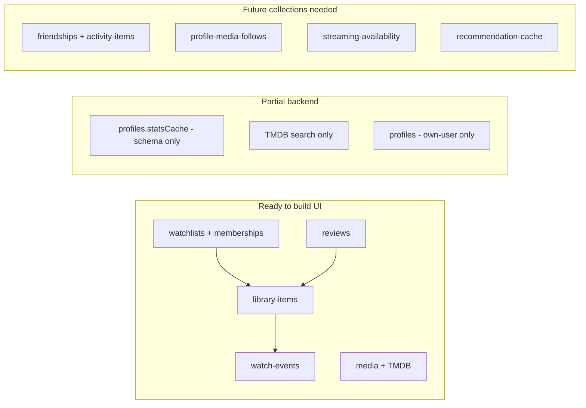
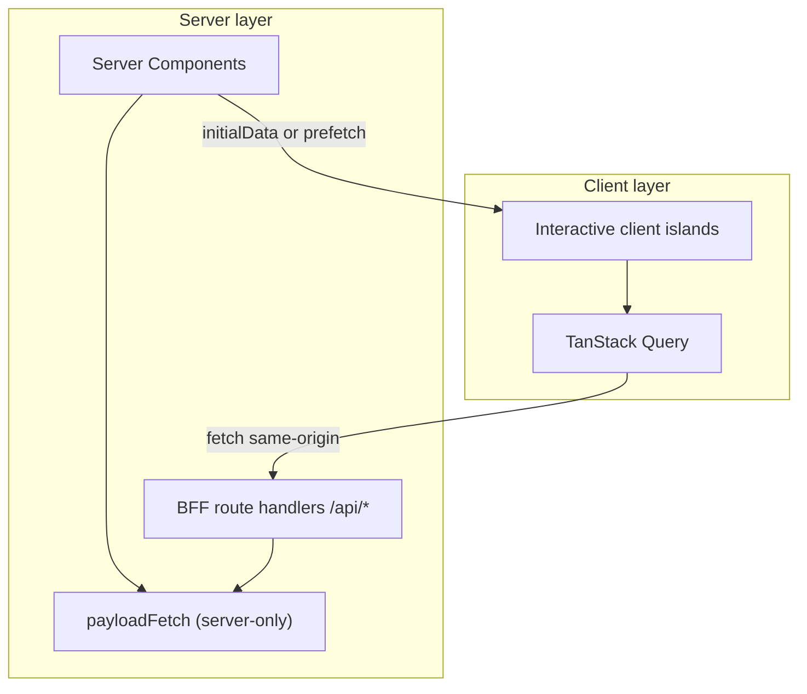

# Page-Based Feature Roadmap (Side Nav Guide)

## Current state

The side nav in [`SidebarMenuItems.tsx`](apps/plotline/src/features/navigation/side-nav/services/SidebarMenuItems.tsx) defines **8 sections and ~50 routes**. Breadcrumbs in [`breadcrumbRoutes.ts`](apps/plotline/src/features/navigation/breadcrumbs/services/breadcrumbRoutes.ts) mirror the same URLs — labels exist, but **46 routes have no `page.tsx` and 404**.

| Status      | Routes | Examples                                           |
| ----------- | ------ | -------------------------------------------------- |
| **Full**    | 1      | `/watchlists`                                      |
| **Partial** | 4      | `/dashboard`, `/watchlists/[slug]`, slug shortcuts |
| **Missing** | 46     | Everything else in the sidebar                     |

**Backend readiness** (Payload collections already exist):



---

## Data fetching strategy — TanStack Query

The existing architecture (`Browser → Clerk → BFF → Payload`) is compatible with TanStack Query. The move is **additive**, not a rewrite.



### Rules

| Layer              | Responsibility                                                                                             |
| ------------------ | ---------------------------------------------------------------------------------------------------------- |
| `src/lib/payload/` | Server-only Payload access (`import 'server-only'`). Single source of truth for query logic.               |
| `src/app/api/`     | BFF boundary — Clerk auth via `requireClerkUserId()`, wraps Payload calls. **All client fetches go here.** |
| TanStack Query     | Client cache, mutations, invalidation, debounce, optimistic updates. **Never imports `@/lib/payload`.**    |
| Server Components  | Initial SSR, auth redirects, static shells. Pass `initialData` to client islands where useful.             |

### What to install (Phase 0a)

- `@tanstack/react-query` (+ `@tanstack/react-query-devtools` dev-only)
- `QueryProvider` in [`layout.tsx`](apps/plotline/src/app/layout.tsx) (client wrapper component)
- Query client defaults: `staleTime` ~30s for lists, `gcTime` ~5m, retry 1 on 5xx

### File layout

```
src/
  lib/
    api/
      auth.ts              # existing — reuse in BFF handlers
      fetch-json.ts        # client-safe fetch wrapper (throws on !ok)
    payload/queries/       # server-only — called by RSC + BFF handlers
    query/
      keys.ts              # centralized query key factory
      hooks/               # useLibraryItems, useWatchlists, useTmdbSearch, etc.
  features/
    library/
      components/          # client islands that consume hooks
  app/api/
    library-items/route.ts # NEW GET — wraps getLibraryItems
    watchlists/route.ts    # NEW GET — wraps getWatchlists (migrate off direct RSC fetch)
    watch-events/route.ts  # NEW GET — wraps getWatchEvents
```

### Query key conventions

```ts
// src/lib/query/keys.ts
export const queryKeys = {
  libraryItems: (filters?: LibraryFilters) =>
    ["library-items", filters] as const,
  watchlists: (filters?: WatchlistFilters) => ["watchlists", filters] as const,
  watchlist: (slug: string) => ["watchlists", slug] as const,
  watchEvents: (filters?: EventFilters) => ["watch-events", filters] as const,
  reviews: (filters?: ReviewFilters) => ["reviews", filters] as const,
  tmdbSearch: (q: string, page: number) => ["tmdb-search", q, page] as const,
};
```

### Mutation + invalidation pattern

Mutations call existing POST BFF routes; on success, invalidate related keys:

| Mutation          | Invalidates                                                    |
| ----------------- | -------------------------------------------------------------- |
| `addToList`       | `libraryItems`, `watchlists`, `watchlist(slug)`                |
| `logWatch`        | `libraryItems`, `watchEvents`, `watchlists`, `watchlist(slug)` |
| `createWatchlist` | `watchlists`                                                   |
| `createReview`    | `reviews`, `libraryItems`                                      |

Use optimistic updates for status changes and log-watch (rollback on error).

### RSC vs TanStack Query — when to use which

| Use RSC (server fetch)                   | Use TanStack Query (client fetch)            |
| ---------------------------------------- | -------------------------------------------- |
| Page shell, metadata, auth redirect      | Debounced TMDB search (`/search`)            |
| First paint with `initialData` hydration | Filter/tab switching without full navigation |
| Rarely-changing static content           | Mutations + cache invalidation               |
|                                          | Optimistic UI (mark watched, change status)  |
|                                          | Infinite scroll (activity feed, history)     |
|                                          | Background refetch after tab focus           |

**Default for new interactive features:** client island + TanStack Query. **Default for page entry:** thin RSC shell that passes `initialData` from server-only queries.

### BFF gap to close

Reads today bypass the BFF (e.g. [`watchlists/page.tsx`](apps/plotline/src/app/watchlists/page.tsx) calls `getWatchlists()` directly). TanStack Query requires **GET BFF routes** that delegate to the same server-only query functions — no duplicated Payload logic.

Priority GET routes to add in Phase 0a:

- `GET /api/library-items?status=&mediaType=`
- `GET /api/watchlists?filter=`
- `GET /api/watchlists/[slug]`
- `GET /api/watch-events?limit=&sort=`
- `GET /api/tmdb/search?q=` (already exists)

Migrate [`/watchlists`](apps/plotline/src/app/watchlists/page.tsx) to the hybrid pattern as the first reference implementation.

---

## Recommended build order

Prioritize pages that unlock the **core tracking loop** first (search → add → view → log), then dashboards and extensions, then features that need new backend work last.

### Phase 0a — TanStack Query setup

**Goal:** Establish client data layer before building interactive pages.

1. Install `@tanstack/react-query` and add `QueryProvider` to root layout
2. Add `src/lib/query/keys.ts` and `src/lib/api/fetch-json.ts`
3. Add GET BFF routes that wrap server-only Payload query functions (see list above)
4. Create base hooks: `useWatchlists`, `useLibraryItems`, `useTmdbSearch`
5. Create base mutations: `useAddToList`, `useLogWatch` wrapping existing POST routes
6. Migrate `/watchlists` to RSC shell + `WatchlistsGrid` client island with `initialData`
7. Document pattern in [`apps/plotline/README.md`](apps/plotline/README.md) Architecture section

### Phase 0b — Shared foundations (do once, reuse everywhere)

Build shared UI + data layer before page sprawl:

- **`src/lib/payload/queries/`** — add `getLibraryItems`, `getWatchEvents`, `getReviews` (REST queries against existing Payload collections; pattern matches [`get-watchlists.ts`](apps/plotline/src/lib/payload/queries/get-watchlists.ts)); consumed by BFF handlers and RSC prefetch
- **Shared components** — `MediaCard`, `LibraryItemRow`, `StatusBadge`, `EmptyState`, `TitleSearchCombobox` (client components using TanStack Query hooks)
- **Wire mutations** — `useAddToList` / `useLogWatch` calling [`POST /api/library/add-to-list`](apps/plotline/src/app/api/library/add-to-list/route.ts) and [`POST /api/library/log-watch`](apps/plotline/src/app/api/library/log-watch/route.ts) with invalidation
- **Route pattern** — one reusable list page + filter config for status/type variants (avoids 8 nearly identical library pages); filters update query key, not full page reload

---

### Phase 1 — Core library loop (highest priority)

**Goal:** User can find a title, add it, see it in their library, and log progress.

**Depends on:** Phase 0a (TanStack Query) + Phase 0b (shared components and Payload queries).

**Suggested order:** 1a → 1b → 1d → 1c (search and library unlock the tracking loop; title detail completes log-watch; watchlist detail extends list viewing).

---

#### Phase 1a — `/search` (`phase-1-search`)

**Routes:** `/search` (sidebar: Discover → Browse → Search TMDB)

**Deliverables:**

- `src/app/search/page.tsx` — thin RSC shell (auth, metadata)
- `src/features/search/components/SearchPage.tsx` — client island
- Debounced `useTmdbSearch(q)` against existing `GET /api/tmdb/search?q=`
- Result rows/cards with **Add to list** action via `useAddToList` (select watchlist or default)
- Empty, loading, and error states (reuse `ErrorEmpty` pattern from watchlists)
- Optional: link from result to title detail route (Phase 1d)

**Out of scope:** `/discover/trending`, `/discover/upcoming` (Phase 6)

---

#### Phase 1b — `/library` + filter routes (`phase-1-library`)

**Routes:**

- `/library` (All Titles)
- `/library/planned`, `/library/watching`, `/library/completed`, `/library/on-hold`, `/library/dropped`
- `/library/movies`, `/library/tv`

**Deliverables:**

- `src/features/library/components/LibraryList.tsx` — shared client island using `useLibraryItems(filters)`
- `src/app/library/page.tsx` + thin wrapper pages per filter segment (each passes initial `status` / `mediaType` into `LibraryList`)
- RSC prefetch via `getLibraryItems()` for `initialData` on first paint
- `MediaCard` / `LibraryItemRow`, `StatusBadge`, empty state
- Filter changes update TanStack Query key — no full page reload when switching tabs within the island
- Row click navigates to title detail (Phase 1d)

**Route pattern:** One shared component; sidebar hrefs stay as separate routes with thin wrappers (not `?status=` query params unless preferred later).

---

#### Phase 1c — `/watchlists/[slug]` (`phase-1-watchlist-detail`)

**Routes:** `/watchlists/[slug]` (serves sidebar shortcuts `/watchlists/watchlist`, `/watchlists/currently-watching`, etc. via slug)

**Deliverables:**

- Replace stub in [`watchlists/[slug]/page.tsx`](apps/plotline/src/app/watchlists/[slug]/page.tsx)
- `useWatchlist(slug)` via `GET /api/watchlists/[slug]` (memberships + populated media)
- Membership media grid with poster, title, list-scoped status
- Challenge progress bar when `challenge.enabled` (from existing `statsCache`)
- Add/remove membership actions with cache invalidation
- Keep existing stats summary; back link to `/watchlists`

**Sidebar note:** `/watchlists/watchlist`, `/watchlists/currently-watching`, and `/watchlists/custom` should **redirect or filter** to system slug pages or filtered `/watchlists` — not separate page implementations.

---

#### Phase 1d — Title detail + log-watch flow (`phase-1-title-detail`)

**Routes:** `/title/[tmdbId]` and/or `/title/[mediaType]/[tmdbId]` (not in sidebar; required to close the loop)

**Deliverables:**

- Title detail page or sheet opened from search/library/watchlist rows
- Display TMDB metadata (from `media` cache or on-demand upsert)
- Current library status for the signed-in user (if in library)
- **Log watch** form — `useLogWatch` → `POST /api/library/log-watch` with optimistic update + rollback
- **Status change** — planned / watching / completed / on hold / dropped via mutation
- **Add to watchlist** — reuse `useAddToList` from search
- Invalidate `libraryItems`, `watchEvents`, `watchlists`, `watchlist(slug)` on success

**Backend:** Fully ready (`library-items`, `watch-events`, `watchlist-memberships`). BFF POST routes already exist.

---

### Phase 2 — Dashboard hub

**Goal:** Login landing page shows actionable snapshots instead of placeholders.

| Order | Route                          | Work                                                                           |
| ----- | ------------------------------ | ------------------------------------------------------------------------------ |
| 2.1   | `/dashboard`                   | Summary cards via parallel `useQuery` calls; invalidate on log-watch mutations |
| 2.2   | `/dashboard/continue-watching` | `useLibraryItems({ status: 'watching' })`                                      |
| 2.3   | `/dashboard/recent-activity`   | `useWatchEvents({ limit: 20 })` — consider `useInfiniteQuery` for load-more    |

**Depends on:** Phase 0 TanStack Query setup + Phase 0b shared components.

---

### Phase 3 — Watchlist & challenge management

**Goal:** Full list CRUD and challenge-mode UX.

| Order | Route(s)                                       | Work                                                                                                                      |
| ----- | ---------------------------------------------- | ------------------------------------------------------------------------------------------------------------------------- |
| 3.1   | `/watchlists/new`                              | `useCreateWatchlist` mutation + form; invalidate `watchlists` key                                                         |
| 3.2   | `/watchlists` enhancements                     | Filter tabs update `watchlists({ filter })` query key                                                                     |
| 3.3   | `/challenges/active`, `/completed`, `/overdue` | Filter watchlists query by `challenge.enabled` + `statsCache.status`                                                      |
| 3.4   | `/challenges/new`                              | Create challenge watchlist mutation                                                                                       |
| 3.5   | BFF                                            | Add `GET /api/watchlists/:slug/stats` + `useWatchlistStats(slug)` hook per [`docs/architecture.md`](docs/architecture.md) |

**Backend:** Challenge model is embedded in `watchlists` — no new collection. Stats recompute already exists in Payload hooks.

---

### Phase 4 — Reviews & ratings

**Goal:** Rate and review watched titles.

| Order | Route                  | Work                                                                                   |
| ----- | ---------------------- | -------------------------------------------------------------------------------------- |
| 4.1   | `/reviews`             | `useReviews()` list with media join                                                    |
| 4.2   | `/reviews/rated`       | Filter query key `{ hasBody: false }`                                                  |
| 4.3   | `/reviews/written`     | Filter query key `{ hasBody: true }`                                                   |
| 4.4   | Inline on title detail | `useCreateReview` / `useUpdateReview` mutations; invalidate `reviews` + `libraryItems` |

**Backend:** `reviews` collection fully defined. Can ship after Phase 1d title detail exists.

---

### Phase 5 — Stats & insights

**Goal:** Personal analytics from watch history.

| Order | Route                                   | Work                                                                                                                                                                                       |
| ----- | --------------------------------------- | ------------------------------------------------------------------------------------------------------------------------------------------------------------------------------------------ |
| 5.1   | `/stats`                                | Summary dashboard — aggregate `library-items` + `watch-events`                                                                                                                             |
| 5.2   | `/stats/history`                        | `useInfiniteQuery` on paginated `watch-events`                                                                                                                                             |
| 5.3   | `/stats/by-platform`                    | Group `watch-events.platform`                                                                                                                                                              |
| 5.4   | `/stats/rewatches`                      | Filter `isRewatch` + `rewatchCount`                                                                                                                                                        |
| 5.5   | `/stats/year/[year]`, `/stats/year/all` | Year-filtered aggregates                                                                                                                                                                   |
| 5.6   | `/stats/year/share`                     | Export/share card (can be static image or link)                                                                                                                                            |
| 5.7   | **Payload work**                        | Implement profile `statsCache` recalculation (schema exists in [`stats-cache.schema.ts`](apps/payload/src/collections/profiles/stats-cache.schema.ts) but is only cleared, never computed) |

**Backend:** Queryable today via `watch-events`; profile cache is optional optimization.

---

### Phase 6 — Discover (TMDB-only subset)

**Goal:** Browse and find new titles without social/recommendation engine.

| Order | Route                | Work                                                  |
| ----- | -------------------- | ----------------------------------------------------- |
| 6.1   | `/discover/trending` | `useQuery` on new `GET /api/tmdb/trending` BFF route  |
| 6.2   | `/discover/upcoming` | `useQuery` on new `GET /api/media/upcoming` BFF route |
| 6.3   | `/discover/for-you`  | **Blocked** — needs `recommendation-cache` collection |
| 6.4   | `/discover/similar`  | **Blocked** — needs similarity engine                 |
| 6.5   | `/discover/friends`  | **Blocked** — needs `friendships`                     |

Ship 6.1–6.2 after `/search` (Phase 1a) reuses TMDB integration patterns.

---

### Phase 7 — Profile

| Route      | Work                                                                             |
| ---------- | -------------------------------------------------------------------------------- |
| `/profile` | `useProfile` + `useUpdateProfile` mutations; longer `staleTime` for profile data |

Low urgency until social features matter.

---

### Phase 8 — Social (defer until backend exists)

All routes **blocked** on new Payload collections per [`apps/plotline/README.md`](apps/plotline/README.md):

| Route                                                 | Prerequisite                          |
| ----------------------------------------------------- | ------------------------------------- |
| `/social/feed`                                        | `activity-items` collection           |
| `/social/friends/activity`, `/social/friends/reviews` | `friendships` + visibility resolution |
| `/social/find`                                        | User discovery API                    |

**Suggested Payload-first order:** `friendships` → `activity-items` → then build feed pages.

---

### Phase 9 — Alerts & availability (defer until backend exists)

| Route                                                            | Prerequisite                                              |
| ---------------------------------------------------------------- | --------------------------------------------------------- |
| `/alerts/following`, `/alerts/episodes`, `/alerts/releases`      | `profile-media-follows` + notification delivery           |
| `/availability`, `/availability/leaving`, `/availability/region` | `streaming-availability` + JustWatch/Reelgood integration |

`profiles.preferences.region` exists but provider data does not.

---

## Side-nav section summary

| Section                    | Routes | Phase                   | Backend          | TanStack Query                 |
| -------------------------- | ------ | ----------------------- | ---------------- | ------------------------------ |
| Data layer (cross-cutting) | —      | 0a                      | Ready            | Setup + GET BFF routes         |
| Dashboard                  | 3      | 2                       | Ready            | Parallel queries               |
| Library (By Status / Type) | 8      | 1b                      | Ready            | Filtered query keys            |
| My Watchlists              | 5      | 1c + 3                  | Ready            | useWatchlist + mutations       |
| Challenges                 | 4      | 3                       | Ready            | Filtered watchlists query      |
| Reviews & Ratings          | 3      | 4                       | Ready            | useReviews + mutations         |
| Stats & Insights           | 7      | 5                       | Partial          | useInfiniteQuery for history   |
| Discover                   | 6      | 1a (search) + 6 (browse) | Partial / Future | useTmdbSearch + browse queries |
| Alerts & Availability      | 6      | 9                       | Future           | Deferred                       |
| Social                     | 5      | 8                       | Future           | Deferred                       |

---

## Suggested milestone cuts

**MVP (usable tracker):** Phases 0a–0b + 1a–1d + 2 — TanStack Query setup, search, library, title detail/log-watch, watchlist detail, dashboard widgets.

**Engagement layer:** Phases 3–5 — challenges, reviews, stats/year-in-review (extend query keys and BFF routes as needed).

**Growth layer:** Phases 6–7 — discover browse, profile.

**Platform layer:** Phases 8–9 — social, alerts, streaming availability (requires new Payload collections first; add query hooks alongside new BFF routes).

---

## Implementation conventions (match existing code)

- **Pages:** Thin Server Components in `apps/plotline/src/app/<route>/page.tsx` — Clerk `auth()` + redirect, optional server prefetch for `initialData`
- **Server data:** Server-only Payload client in `src/lib/payload/` — used by BFF handlers and RSC prefetch only; never imported in client components
- **Client data:** TanStack Query hooks in `src/lib/query/hooks/` — fetch same-origin `/api/*` routes only
- **BFF handlers:** All reads and writes under `src/app/api/` — delegate to shared Payload query functions in `src/lib/payload/queries/`
- **Mutations:** `useMutation` calling POST BFF routes; invalidate related query keys on success; optimistic updates for status/log-watch
- **Nav:** Register new routes only in sidebar if URL is real; consider hiding or disabling links for Phase 8–9 until backend ships to avoid 404s
- **Filter routes:** Shared client list component; sidebar hrefs map to route segments that set initial filter props/query key — TanStack Query handles refetch on filter change without full navigation
