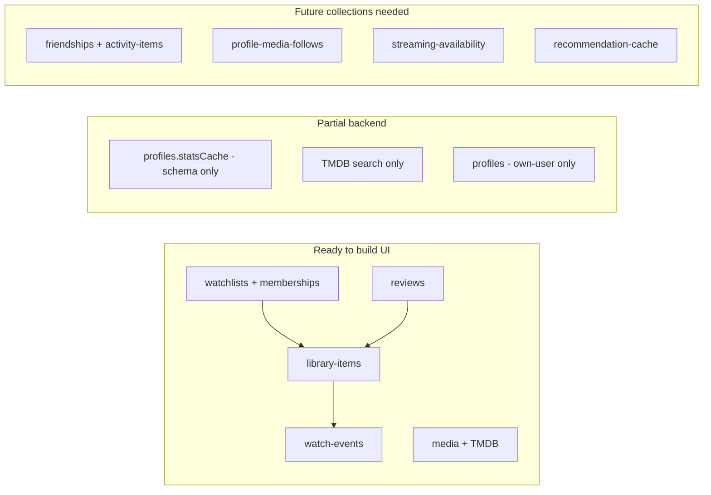
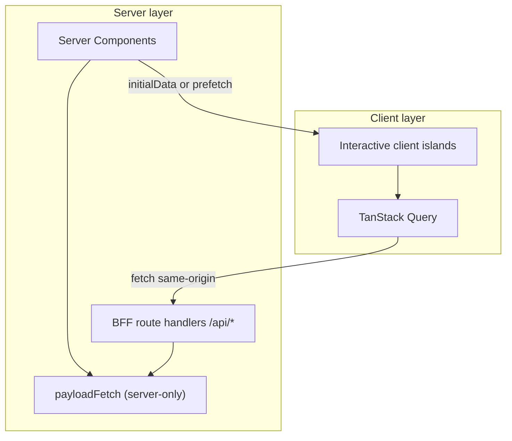
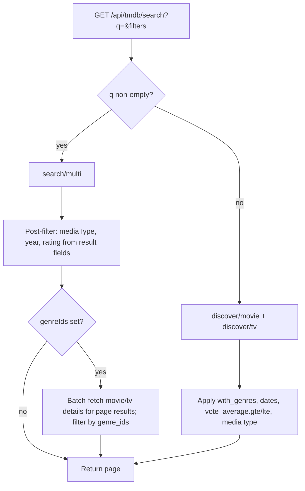

# Page-Based Feature Roadmap (Side Nav Guide)

## Current state

The side nav in [`sidebar-menu-items.tsx`](apps/plotline/src/features/navigation/side-nav/services/sidebar-menu-items.tsx) defines **8 sections and ~50 routes**. Breadcrumbs in [`breadcrumb-routes.ts`](apps/plotline/src/features/navigation/breadcrumbs/services/breadcrumb-routes.ts) mirror the same URLs — labels exist, but most routes have no `page.tsx` and 404.

**Routing convention:** All authenticated side-nav pages live under **`/dashboard/*`**. Public routes (`/`, `/sign-in`, `/sign-up`) stay at the root. BFF API routes stay at `/api/*`.

| Status      | Routes | Examples                                                     |
| ----------- | ------ | ------------------------------------------------------------ |
| **Full**    | 1      | `/dashboard/watchlists` (migrate from `/watchlists`)         |
| **Partial** | 4      | `/dashboard`, `/dashboard/watchlists/[slug]`, slug shortcuts |
| **Missing** | ~46    | Everything else in the sidebar                               |

**Backend readiness** (Payload collections already exist):



---

## Route namespace — all side-nav pages under `/dashboard`

### App Router structure

All side-nav pages nest under a shared dashboard layout:

```
src/app/dashboard/
  layout.tsx                    # optional shared padding/max-width; auth assumed via proxy
  page.tsx                      # Overview (/dashboard)
  continue-watching/page.tsx
  recent-activity/page.tsx
  search/page.tsx               # Phase 1a
  library/
    page.tsx                    # All Titles
    planned/page.tsx
    watching/page.tsx
    completed/page.tsx
    on-hold/page.tsx
    dropped/page.tsx
    movies/page.tsx
    tv/page.tsx
  watchlists/
    page.tsx
    new/page.tsx
    [slug]/page.tsx
  challenges/
    active/page.tsx
    completed/page.tsx
    overdue/page.tsx
    new/page.tsx
  reviews/
    page.tsx
    rated/page.tsx
    written/page.tsx
  stats/
    page.tsx
    history/page.tsx
    by-platform/page.tsx
    rewatches/page.tsx
    year/[year]/page.tsx
    year/all/page.tsx
    year/share/page.tsx
  discover/
    for-you/page.tsx
    similar/page.tsx
    friends/page.tsx
    upcoming/page.tsx
    trending/page.tsx
  alerts/
    following/page.tsx
    episodes/page.tsx
    releases/page.tsx
  availability/
    page.tsx
    leaving/page.tsx
    region/page.tsx
  social/
    feed/page.tsx
    find/page.tsx
    friends/activity/page.tsx
    friends/reviews/page.tsx
  profile/page.tsx
  title/[mediaType]/[tmdbId]/page.tsx   # not in sidebar; closes tracking loop
```

### Side-nav href mapping (old → new)

Update [`sidebar-menu-items.tsx`](apps/plotline/src/features/navigation/side-nav/services/sidebar-menu-items.tsx) and [`breadcrumb-routes.ts`](apps/plotline/src/features/navigation/breadcrumbs/services/breadcrumb-routes.ts) section hrefs accordingly.

| Section                             | Old href                           | New href                                               |
| ----------------------------------- | ---------------------------------- | ------------------------------------------------------ |
| Dashboard → Overview                | `/dashboard`                       | `/dashboard` (unchanged)                               |
| Dashboard → Continue Watching       | `/dashboard/continue-watching`     | `/dashboard/continue-watching` (unchanged)             |
| Dashboard → Recent Activity         | `/dashboard/recent-activity`       | `/dashboard/recent-activity` (unchanged)               |
| Library → All Titles                | `/library`                         | `/dashboard/library`                                   |
| Library → status filters            | `/library/planned`, etc.           | `/dashboard/library/planned`, etc.                     |
| Library → type filters              | `/library/movies`, `/library/tv`   | `/dashboard/library/movies`, `/dashboard/library/tv`   |
| Watchlists                          | `/watchlists`, `/watchlists/*`     | `/dashboard/watchlists`, `/dashboard/watchlists/*`     |
| Challenges                          | `/challenges/*`                    | `/dashboard/challenges/*`                              |
| Reviews                             | `/reviews`, `/reviews/*`           | `/dashboard/reviews`, `/dashboard/reviews/*`           |
| Stats                               | `/stats`, `/stats/*`               | `/dashboard/stats`, `/dashboard/stats/*`               |
| Discover → Browse → **Search TMDB** | `/search`                          | **`/dashboard/search`**                                |
| Discover                            | `/discover/*`                      | `/dashboard/discover/*`                                |
| Alerts                              | `/alerts/*`                        | `/dashboard/alerts/*`                                  |
| Availability                        | `/availability`, `/availability/*` | `/dashboard/availability`, `/dashboard/availability/*` |
| Social                              | `/social/*`, `/profile`            | `/dashboard/social/*`, `/dashboard/profile`            |

### Migration tasks (Phase 0c)

1. Move existing pages (`/watchlists`, `/watchlists/[slug]`) → `src/app/dashboard/watchlists/`
2. Update all sidebar hrefs and breadcrumb `sectionHref` values to `/dashboard/...` prefixes
3. Update dynamic breadcrumb patterns (watchlist slug parent → `/dashboard/watchlists`; stats year parent → `/dashboard/stats`)
4. Update [`getTitleHref`](apps/plotline/src/features/library/utils/media-display.ts) → `/dashboard/title/${mediaType}/${tmdbId}`
5. Add temporary redirects from old top-level paths (`/watchlists` → `/dashboard/watchlists`, etc.) if any bookmarks exist
6. Confirm Clerk `proxy.ts` still treats `/dashboard/*` as protected (already covered by protected-first strategy)

---

## Data fetching strategy — TanStack Query

The existing architecture (`Browser → Clerk → BFF → Payload`) is compatible with TanStack Query. The move is **additive**, not a rewrite.



### Rules

| Layer              | Responsibility                                                                                             |
| ------------------ | ---------------------------------------------------------------------------------------------------------- |
| `src/lib/payload/` | Server-only Payload access (`import 'server-only'`). Single source of truth for query logic.               |
| `src/app/api/`     | BFF boundary — Clerk auth via `requireClerkUserId()`, wraps Payload calls. **All client fetches go here.** |
| TanStack Query     | Client cache, mutations, invalidation, debounce, optimistic updates. **Never imports `@/lib/payload`.**    |
| Server Components  | Initial SSR, auth redirects, static shells. Pass `initialData` to client islands where useful.             |

### What to install (Phase 0a)

- `@tanstack/react-query` (+ `@tanstack/react-query-devtools` dev-only)
- `QueryProvider` in [`layout.tsx`](apps/plotline/src/app/layout.tsx) (client wrapper component)
- Query client defaults: `staleTime` ~30s for lists, `gcTime` ~5m, retry 1 on 5xx

### File layout

```
src/
  lib/
    api/
      auth.ts              # existing — reuse in BFF handlers
      fetch-json.ts        # client-safe fetch wrapper (throws on !ok)
    payload/queries/       # server-only — called by RSC + BFF handlers
    query/
      keys.ts              # centralized query key factory
      hooks/               # useLibraryItems, useWatchlists, useTmdbSearch, etc.
  features/
    library/
      components/          # client islands that consume hooks
  app/api/
    library-items/route.ts # NEW GET — wraps getLibraryItems
    watchlists/route.ts    # NEW GET — wraps getWatchlists (migrate off direct RSC fetch)
    watch-events/route.ts  # NEW GET — wraps getWatchEvents
```

### Query key conventions

```ts
// src/lib/query/keys.ts
export const queryKeys = {
  libraryItems: (filters?: LibraryFilters) =>
    ["library-items", filters] as const,
  watchlists: (filters?: WatchlistFilters) => ["watchlists", filters] as const,
  watchlist: (slug: string) => ["watchlists", slug] as const,
  watchEvents: (filters?: EventFilters) => ["watch-events", filters] as const,
  reviews: (filters?: ReviewFilters) => ["reviews", filters] as const,
  tmdbSearch: (q: string, filters: SearchFilters, page: number) =>
    ["tmdb-search", q, filters, page] as const,
  tmdbGenres: () => ["tmdb-genres"] as const,
};
```

### Mutation + invalidation pattern

Mutations call existing POST BFF routes; on success, invalidate related keys:

| Mutation          | Invalidates                                                    |
| ----------------- | -------------------------------------------------------------- |
| `addToList`       | `libraryItems`, `watchlists`, `watchlist(slug)`                |
| `logWatch`        | `libraryItems`, `watchEvents`, `watchlists`, `watchlist(slug)` |
| `createWatchlist` | `watchlists`                                                   |
| `createReview`    | `reviews`, `libraryItems`                                      |

Use optimistic updates for status changes and log-watch (rollback on error).

### RSC vs TanStack Query — when to use which

| Use RSC (server fetch)                   | Use TanStack Query (client fetch)            |
| ---------------------------------------- | -------------------------------------------- |
| Page shell, metadata, auth redirect      | Debounced TMDB search (`/dashboard/search`)  |
| First paint with `initialData` hydration | Filter/tab switching without full navigation |
| Rarely-changing static content           | Mutations + cache invalidation               |
|                                          | Optimistic UI (mark watched, change status)  |
|                                          | Infinite scroll (activity feed, history)     |
|                                          | Background refetch after tab focus           |

**Default for new interactive features:** client island + TanStack Query. **Default for page entry:** thin RSC shell that passes `initialData` from server-only queries.

### BFF gap to close

Reads today bypass the BFF (e.g. [`watchlists/page.tsx`](apps/plotline/src/app/watchlists/page.tsx) calls `getWatchlists()` directly). TanStack Query requires **GET BFF routes** that delegate to the same server-only query functions — no duplicated Payload logic.

Priority GET routes to add in Phase 0a:

- `GET /api/library-items?status=&mediaType=`
- `GET /api/watchlists?filter=`
- `GET /api/watchlists/[slug]`
- `GET /api/watch-events?limit=&sort=`
- `GET /api/tmdb/search?q=` (already exists)

Migrate [`/dashboard/watchlists`](apps/plotline/src/app/dashboard/watchlists/page.tsx) to the hybrid pattern as the first reference implementation (after Phase 0c move from `/watchlists`).

---

## Recommended build order

Prioritize pages that unlock the **core tracking loop** first (search → add → view → log), then dashboards and extensions, then features that need new backend work last.

### Phase 0a — TanStack Query setup

**Goal:** Establish client data layer before building interactive pages.

1. Install `@tanstack/react-query` and add `QueryProvider` to root layout
2. Add `src/lib/query/keys.ts` and `src/lib/api/fetch-json.ts`
3. Add GET BFF routes that wrap server-only Payload query functions (see list above)
4. Create base hooks: `useWatchlists`, `useLibraryItems`, `useTmdbSearch`
5. Create base mutations: `useAddToList`, `useLogWatch` wrapping existing POST routes
6. Migrate `/watchlists` → `/dashboard/watchlists` (Phase 0c) + hybrid RSC shell + `WatchlistsGrid` client island with `initialData`
7. Document pattern in [`apps/plotline/README.md`](apps/plotline/README.md) Architecture section

### Phase 0b — Shared foundations (do once, reuse everywhere)

Build shared UI + data layer before page sprawl:

- **`src/lib/payload/queries/`** — add `getLibraryItems`, `getWatchEvents`, `getReviews` (REST queries against existing Payload collections; pattern matches [`get-watchlists.ts`](apps/plotline/src/lib/payload/queries/get-watchlists.ts)); consumed by BFF handlers and RSC prefetch
- **Shared components** — `MediaGridItem`, `MediaListItem`, `StatusBadge`, `EmptyState`, `TitleSearchCombobox` (client components using TanStack Query hooks)
- **Wire mutations** — `useAddToList` / `useLogWatch` calling [`POST /api/library/add-to-list`](apps/plotline/src/app/api/library/add-to-list/route.ts) and [`POST /api/library/log-watch`](apps/plotline/src/app/api/library/log-watch/route.ts) with invalidation
- **Route pattern** — one reusable list page + filter config for status/type variants under `/dashboard/library/*`; filters update query key, not full page reload

### Phase 0c — Route namespace migration

**Goal:** All side-nav hrefs and App Router pages live under `/dashboard/*` before building new routes.

See [Route namespace](#route-namespace--all-side-nav-pages-under-dashboard) section above. Block Phase 1 page work until sidebar hrefs and app directory structure match the new convention (or migrate in the same PR as Phase 1a).

---

### Phase 1 — Core library loop (highest priority)

**Goal:** User can find a title, add it, see it in their library, and log progress.

**Depends on:** Phase 0a (TanStack Query) + Phase 0b (shared components and Payload queries).

**Suggested order:** 1a → 1b → 1d → 1c (search and library unlock the tracking loop; title detail completes log-watch; watchlist detail extends list viewing).

---

**Depends on:** Phase 0a + 0b + **0c** (route namespace).

**Suggested order:** 0c → 1a → 1b → 1d → 1c.

---

#### Phase 1a — `/dashboard/search` (`phase-1-search`)

**Route:** `/dashboard/search` (sidebar: Discover → Browse → Search TMDB)

**Page layout (top to bottom):**

1. **Search input** — shadcn **Input Group** at the top
2. **Filter bar** — active-filter badges + **Show Filters** button (right-aligned)
3. **Results grid** — responsive poster grid below the filter bar

**Search input spec:**

| Element        | Spec                                                                                                                 |
| -------------- | -------------------------------------------------------------------------------------------------------------------- |
| Component      | shadcn Input Group — [`input-group.tsx`](apps/plotline/src/components/ui/input-group.tsx) (already present)          |
| Leading addon  | Search icon (`Search` from lucide-react) in `InputGroupAddon` aligned to the **start**                               |
| Input          | Controlled text field; debounced (~300ms) before firing search query                                                 |
| Trailing addon | **Clear** button in `InputGroupAddon` at the **end** — visible when query non-empty; clears input and resets results |
| Placeholder    | e.g. "Search movies and series…"                                                                                     |

**Filter bar spec (between input and grid):**

| Element             | Spec                                                                                                                     |
| ------------------- | ------------------------------------------------------------------------------------------------------------------------ |
| Layout              | Horizontal flex row — active filter badges on the left (wrap), **Show Filters** button `ml-auto` on the right            |
| Active badges       | One `Badge` per applied filter (removable via click/X): e.g. `Series`, `Horror`, `2010–2019`, `Rating 7–10`              |
| Show Filters button | Opens a shadcn **Sheet** (`side="right"`) — add [`sheet.tsx`](apps/plotline/src/components/ui/sheet.tsx) already present |
| Empty state         | When no filters applied, bar shows only the Show Filters button (no badges)                                              |

**Filter sheet spec (Sheet content):**

Install missing shadcn components before building:

```bash
pnpm dlx shadcn@latest add field toggle-group slider checkbox -c apps/plotline
```

All controls wrapped in **Field** / **FieldGroup** / **FieldLabel** / **FieldDescription** as applicable.

| Filter       | Component                                 | Behavior                                                                                                                                               |
| ------------ | ----------------------------------------- | ------------------------------------------------------------------------------------------------------------------------------------------------------ |
| Media type   | **Toggle Group** (`type="single"`)        | Options: **All** / **Film** / **Series** — maps to `movie` / `tv` / unset                                                                              |
| Genre        | **Checkbox** list inside a **FieldGroup** | Multi-select TMDB genre IDs; load options from `GET /api/tmdb/genres?mediaType=` (movie + tv lists merged/deduped in UI or separate sections per type) |
| Release year | **Slider**                                | Range slider (min/max year), e.g. 1950–current year; show selected range in `FieldDescription`                                                         |
| Rating       | Two **Input** fields in a **FieldGroup**  | Min rating and max rating (0–10, step 0.5); validate min ≤ max                                                                                         |
| Actions      | Sheet footer                              | **Apply Filters** (closes sheet, triggers refetch) + **Clear all** (resets to defaults)                                                                |

**Results grid spec:**

| Element           | Spec                                                                                                                                                                                                                                                                                                                              |
| ----------------- | --------------------------------------------------------------------------------------------------------------------------------------------------------------------------------------------------------------------------------------------------------------------------------------------------------------------------------- |
| Layout            | CSS grid — e.g. `grid-cols-2 sm:grid-cols-3 md:grid-cols-4 lg:grid-cols-5 gap-4`                                                                                                                                                                                                                                                  |
| Grid item         | Use [`MediaGridItem`](apps/plotline/src/features/media/components/MediaGridItem.tsx) — **grid variant** of the split media card API. **Do not** create a separate `SearchResultCard` component                                                                                                                                    |
| List variant      | [`MediaListItem`](apps/plotline/src/features/media/components/MediaListItem.tsx) is for row/list layouts (library, activity feeds) — **not** used on the search results grid                                                                                                                                                      |
| Navigation        | `MediaGridItem` links via `getMediaItemDisplay()` → `getTitleHref()` → `/dashboard/title/[mediaType]/[tmdbId]`                                                                                                                                                                                                                    |
| Poster            | Shared [`MediaPoster`](apps/plotline/src/features/media/components/MediaPoster.tsx) inside `MediaGridItem` `ItemHeader` — no duplicate poster logic                                                                                                                                                                               |
| Rating badge      | **Augment `MediaGridItem` / `MediaPoster`:** optional `voteAverage?: number` on `MediaDisplay`; when present, render a `Badge` overlay in the **top-right corner** of the poster (one decimal, e.g. `8.4`); omit when undefined. Rating badge is **grid-only** (search/discover grids); list variant does not show poster overlay |
| Metadata row      | Grid subtitle via [`getMediaItemDisplay`](apps/plotline/src/features/media/services/get-media-item-display.ts) (`variant: "grid"`) — **Film** / **Series** + release year; search maps TMDB results with [`toMediaDisplayFromTmdbResult`](apps/plotline/src/features/media/services/media-display.ts)                             |
| Actions slot      | `MediaGridItem` accepts optional `actions?: ReactNode` — omit on search grid initially, or pass add-to-list button via `actions` in a fast-follow                                                                                                                                                                                 |
| Search grid usage | `SearchResultGrid` maps each result to `<MediaGridItem media={...} />` with `voteAverage` populated from TMDB `vote_average`                                                                                                                                                                                                      |

**`MediaGridItem` augmentation checklist:**

- Extend [`MediaDisplay`](apps/plotline/src/features/media/types.ts) base fields with optional `voteAverage?: number`
- Render rating `Badge` on [`MediaPoster`](apps/plotline/src/features/media/components/MediaPoster.tsx) (preferred) or `ItemHeader` wrapper — absolutely positioned top-right on poster only
- Do **not** add rating overlay to `MediaListItem` unless product asks for list-row ratings later
- Keep `MediaListItem` unchanged for Phase 1b library list layouts

**Filter data model & BFF strategy:**

TMDB `/search/multi` does not support genre/year/rating params and search results omit genres. Support **text + filters together** via a unified BFF that picks the best strategy:



**`SearchFilters` type** (shared):

```ts
type SearchFilters = {
  mediaType?: "movie" | "tv"; // Film / Series; omit = All
  genreIds?: number[]; // TMDB genre IDs (multi)
  yearMin?: number;
  yearMax?: number;
  ratingMin?: number;
  ratingMax?: number;
};
```

**BFF work** (extend [`/api/tmdb/search`](apps/plotline/src/app/api/tmdb/search/route.ts) or add `/api/tmdb/browse`):

| Param                    | Maps to                                                                |
| ------------------------ | ---------------------------------------------------------------------- |
| `q`                      | Text query (optional when browsing by filters only)                    |
| `mediaType`              | Filter / discover endpoint selection                                   |
| `genreIds`               | Comma-separated IDs → `with_genres` (discover) or post-filter (search) |
| `yearMin`, `yearMax`     | Discover date params / post-filter on search result dates              |
| `ratingMin`, `ratingMax` | `vote_average.gte/lte` / post-filter on `vote_average`                 |
| `page`                   | Pagination                                                             |

**Text + genre simultaneously:** When `q` and `genreIds` are both set, BFF runs `search/multi`, post-filters type/year/rating from result fields, then **enriches the current page** with lightweight TMDB detail calls to read `genre_ids` and drops non-matching items. Accept that genre filtering may yield sparse pages (optionally backfill by fetching additional search pages server-side in a follow-up).

**Text-only / filters-only:**

- **q only** → existing `searchMulti` + optional client-side type/year/rating post-filter
- **filters only, no q** → TMDB Discover (`discoverMovie` / `discoverTv`) with full server-side filters — add methods to [`TmdbClient`](packages/shared/src/tmdb/client.ts)
- **q + non-genre filters** → search + BFF post-filter (no extra TMDB calls)

**TanStack Query:**

- Extend `queryKeys.tmdbSearch(q, filters, page)` in [`keys.ts`](apps/plotline/src/lib/query/services/keys.ts)
- Replace or extend `useTmdbSearch` → `useTmdbBrowse(query, filters, page)` in `src/features/search/hooks/`
- Sheet **Apply** updates filter state → invalidates query key; badges reflect applied (not draft) filters

**Data & behavior:**

- `enabled`: `q.length >= 2` **OR** at least one filter active (browse-without-text mode)
- Loading: skeleton grid; empty query + no filters → prompt state
- No results: `EmptyState`; error: `ErrorEmpty`
- Genre list: new `GET /api/tmdb/genres` BFF wrapping TMDB `/genre/movie/list` + `/genre/tv/list` (cache aggressively — static data)

**Files:**

- `src/app/dashboard/search/page.tsx` — thin RSC shell
- `src/features/search/components/SearchPage.tsx` — client island; owns filter + query state
- `src/features/search/components/SearchInputGroup.tsx`
- `src/features/search/components/SearchFilterBar.tsx` — badges + Show Filters button
- `src/features/search/components/SearchFiltersSheet.tsx` — Sheet with Field/ToggleGroup/Checkbox/Slider/Input controls
- `src/features/search/components/SearchResultGrid.tsx` — maps TMDB results to `MediaGridItem`
- `src/features/media/components/MediaGridItem.tsx` — grid variant (search/discover grids)
- `src/features/media/components/MediaListItem.tsx` — list variant (library rows; no search grid)
- `src/features/media/components/MediaPoster.tsx` — optional rating badge overlay on poster
- `src/features/media/types.ts` — add `voteAverage` to `MediaDisplay` base
- `src/features/search/hooks/use-search-filters.ts` — applied vs draft filter state, badge labels
- `src/features/search/hooks/use-tmdb-browse.ts` — TanStack Query hook
- `src/features/search/types.ts` — `SearchFilters`, defaults
- `packages/shared/src/tmdb/client.ts` — `discoverMovie`, `discoverTv`, `getGenreLists`
- `src/app/api/tmdb/search/route.ts` — extend with filter params (or sibling `/api/tmdb/browse`)
- `src/app/api/tmdb/genres/route.ts` — genre list for checkbox UI

**Out of scope:** `/dashboard/discover/trending`, `/dashboard/discover/upcoming` (Phase 6); URL-synced filters via nuqs (optional fast-follow)

---

#### Phase 1b — `/dashboard/library` + filter routes (`phase-1-library`)

**Routes:**

- `/dashboard/library` (All Titles)
- `/dashboard/library/planned`, `/watching`, `/completed`, `/on-hold`, `/dropped`
- `/dashboard/library/movies`, `/dashboard/library/tv`

**Deliverables:**

- `src/features/library/components/LibraryList.tsx` — shared client island using `useLibraryItems(filters)`
- `src/app/dashboard/library/page.tsx` + thin wrapper pages per filter segment (each passes initial `status` / `mediaType` into `LibraryList`)
- RSC prefetch via `getLibraryItems()` for `initialData` on first paint
- Reuse `MediaListItem` for library rows, `MediaGridItem` where grid layout applies, `StatusBadge`, `EmptyState`
- Filter changes update TanStack Query key — no full page reload when switching tabs within the island
- Row click navigates to `/dashboard/title/[mediaType]/[tmdbId]` (Phase 1d)

**Route pattern:** One shared component; sidebar hrefs stay as separate routes with thin wrappers under `src/app/dashboard/library/`.

---

#### Phase 1c — `/dashboard/watchlists/[slug]` (`phase-1-watchlist-detail`)

**Routes:** `/dashboard/watchlists/[slug]` (serves sidebar shortcuts `/dashboard/watchlists/watchlist`, `/dashboard/watchlists/currently-watching`, etc. via slug)

**Deliverables:**

- Replace stub in `src/app/dashboard/watchlists/[slug]/page.tsx`
- `useWatchlist(slug)` via `GET /api/watchlists/[slug]` (memberships + populated media)
- Membership media grid with poster, title, list-scoped status
- Challenge progress bar when `challenge.enabled` (from existing `statsCache`)
- Add/remove membership actions with cache invalidation
- Keep existing stats summary; back link to `/dashboard/watchlists`

**Sidebar note:** `/dashboard/watchlists/watchlist`, `/dashboard/watchlists/currently-watching`, and `/dashboard/watchlists/custom` should **redirect or filter** to system slug pages or filtered `/dashboard/watchlists` — not separate page implementations.

---

#### Phase 1d — Title detail + log-watch flow (`phase-1-title-detail`)

**Route:** `/dashboard/title/[mediaType]/[tmdbId]` (not in sidebar; linked from search grid, library, watchlists)

**Deliverables:**

- Title detail page opened from search grid items, library rows, watchlist memberships
- Display TMDB metadata (from `media` cache or on-demand upsert)
- Current library status for the signed-in user (if in library)
- **Log watch** form — `useLogWatch` → `POST /api/library/log-watch` with optimistic update + rollback
- **Status change** — planned / watching / completed / on hold / dropped via mutation
- **Add to watchlist** — reuse `useAddToList` from search
- Invalidate `libraryItems`, `watchEvents`, `watchlists`, `watchlist(slug)` on success

**Backend:** Fully ready (`library-items`, `watch-events`, `watchlist-memberships`). BFF POST routes already exist.

---

### Phase 2 — Dashboard hub

**Goal:** Login landing page shows actionable snapshots instead of placeholders.

| Order | Route                          | Work                                                                           |
| ----- | ------------------------------ | ------------------------------------------------------------------------------ |
| 2.1   | `/dashboard`                   | Summary cards via parallel `useQuery` calls; invalidate on log-watch mutations |
| 2.2   | `/dashboard/continue-watching` | `useLibraryItems({ status: 'watching' })`                                      |
| 2.3   | `/dashboard/recent-activity`   | `useWatchEvents({ limit: 20 })` — consider `useInfiniteQuery` for load-more    |

**Depends on:** Phase 0 TanStack Query setup + Phase 0b shared components.

---

### Phase 3 — Watchlist & challenge management

**Goal:** Full list CRUD and challenge-mode UX.

| Order | Route(s)                                                 | Work                                                                                                                      |
| ----- | -------------------------------------------------------- | ------------------------------------------------------------------------------------------------------------------------- |
| 3.1   | `/dashboard/watchlists/new`                              | `useCreateWatchlist` mutation + form; invalidate `watchlists` key                                                         |
| 3.2   | `/dashboard/watchlists` enhancements                     | Filter tabs update `watchlists({ filter })` query key                                                                     |
| 3.3   | `/dashboard/challenges/active`, `/completed`, `/overdue` | Filter watchlists query by `challenge.enabled` + `statsCache.status`                                                      |
| 3.4   | `/dashboard/challenges/new`                              | Create challenge watchlist mutation                                                                                       |
| 3.5   | BFF                                                      | Add `GET /api/watchlists/:slug/stats` + `useWatchlistStats(slug)` hook per [`docs/architecture.md`](docs/architecture.md) |

**Backend:** Challenge model is embedded in `watchlists` — no new collection. Stats recompute already exists in Payload hooks.

---

### Phase 4 — Reviews & ratings

**Goal:** Rate and review watched titles.

| Order | Route                        | Work                                                                                   |
| ----- | ---------------------------- | -------------------------------------------------------------------------------------- |
| 4.1   | `/dashboard/reviews`         | `useReviews()` list with media join                                                    |
| 4.2   | `/dashboard/reviews/rated`   | Filter query key `{ hasBody: false }`                                                  |
| 4.3   | `/dashboard/reviews/written` | Filter query key `{ hasBody: true }`                                                   |
| 4.4   | Inline on title detail       | `useCreateReview` / `useUpdateReview` mutations; invalidate `reviews` + `libraryItems` |

**Backend:** `reviews` collection fully defined. Can ship after Phase 1d title detail exists.

---

### Phase 5 — Stats & insights

**Goal:** Personal analytics from watch history.

| Order | Route                                                       | Work                                                                                                                                                                                       |
| ----- | ----------------------------------------------------------- | ------------------------------------------------------------------------------------------------------------------------------------------------------------------------------------------ |
| 5.1   | `/dashboard/stats`                                          | Summary dashboard — aggregate `library-items` + `watch-events`                                                                                                                             |
| 5.2   | `/dashboard/stats/history`                                  | `useInfiniteQuery` on paginated `watch-events`                                                                                                                                             |
| 5.3   | `/dashboard/stats/by-platform`                              | Group `watch-events.platform`                                                                                                                                                              |
| 5.4   | `/dashboard/stats/rewatches`                                | Filter `isRewatch` + `rewatchCount`                                                                                                                                                        |
| 5.5   | `/dashboard/stats/year/[year]`, `/dashboard/stats/year/all` | Year-filtered aggregates                                                                                                                                                                   |
| 5.6   | `/dashboard/stats/year/share`                               | Export/share card (can be static image or link)                                                                                                                                            |
| 5.7   | **Payload work**                                            | Implement profile `statsCache` recalculation (schema exists in [`stats-cache.schema.ts`](apps/payload/src/collections/profiles/stats-cache.schema.ts) but is only cleared, never computed) |

**Backend:** Queryable today via `watch-events`; profile cache is optional optimization.

---

### Phase 6 — Discover (TMDB-only subset)

**Goal:** Browse and find new titles without social/recommendation engine.

| Order | Route                          | Work                                                  |
| ----- | ------------------------------ | ----------------------------------------------------- |
| 6.1   | `/dashboard/discover/trending` | `useQuery` on new `GET /api/tmdb/trending` BFF route  |
| 6.2   | `/dashboard/discover/upcoming` | `useQuery` on new `GET /api/media/upcoming` BFF route |
| 6.3   | `/dashboard/discover/for-you`  | **Blocked** — needs `recommendation-cache` collection |
| 6.4   | `/dashboard/discover/similar`  | **Blocked** — needs similarity engine                 |
| 6.5   | `/dashboard/discover/friends`  | **Blocked** — needs `friendships`                     |

Ship 6.1–6.2 after `/dashboard/search` (Phase 1a) reuses TMDB integration patterns.

---

### Phase 7 — Profile

| Route                | Work                                                                             |
| -------------------- | -------------------------------------------------------------------------------- |
| `/dashboard/profile` | `useProfile` + `useUpdateProfile` mutations; longer `staleTime` for profile data |

Low urgency until social features matter.

---

### Phase 8 — Social (defer until backend exists)

All routes **blocked** on new Payload collections per [`apps/plotline/README.md`](apps/plotline/README.md):

| Route                                                                     | Prerequisite                          |
| ------------------------------------------------------------------------- | ------------------------------------- |
| `/dashboard/social/feed`                                                  | `activity-items` collection           |
| `/dashboard/social/friends/activity`, `/dashboard/social/friends/reviews` | `friendships` + visibility resolution |
| `/dashboard/social/find`                                                  | User discovery API                    |

**Suggested Payload-first order:** `friendships` → `activity-items` → then build feed pages.

---

### Phase 9 — Alerts & availability (defer until backend exists)

| Route                                                                                          | Prerequisite                                              |
| ---------------------------------------------------------------------------------------------- | --------------------------------------------------------- |
| `/dashboard/alerts/following`, `/dashboard/alerts/episodes`, `/dashboard/alerts/releases`      | `profile-media-follows` + notification delivery           |
| `/dashboard/availability`, `/dashboard/availability/leaving`, `/dashboard/availability/region` | `streaming-availability` + JustWatch/Reelgood integration |

`profiles.preferences.region` exists but provider data does not.

---

## Side-nav section summary

| Section                    | Routes | Phase                              | Backend          | TanStack Query                   |
| -------------------------- | ------ | ---------------------------------- | ---------------- | -------------------------------- |
| Route namespace            | all    | 0c                                 | —                | —                                |
| Data layer (cross-cutting) | —      | 0a                                 | Ready            | Setup + GET BFF routes           |
| Dashboard                  | 3      | 2                                  | Ready            | Parallel queries                 |
| Library (By Status / Type) | 8      | 1b                                 | Ready            | Filtered query keys              |
| My Watchlists              | 5      | 1c + 3                             | Ready            | useWatchlist + mutations         |
| Challenges                 | 4      | 3                                  | Ready            | Filtered watchlists query        |
| Reviews & Ratings          | 3      | 4                                  | Ready            | useReviews + mutations           |
| Stats & Insights           | 7      | 5                                  | Partial          | useInfiniteQuery for history     |
| Discover                   | 6      | 1a (search + filters) + 6 (browse) | Partial / Future | useTmdbBrowse + genre list query |
| Alerts & Availability      | 6      | 9                                  | Future           | Deferred                         |
| Social                     | 5      | 8                                  | Future           | Deferred                         |

All route paths prefixed with `/dashboard/` except public auth/landing pages.

---

## Suggested milestone cuts

**MVP (usable tracker):** Phases 0a–0c + 1a–1d + 2 — route namespace, TanStack Query, `/dashboard/search`, library, title detail/log-watch, watchlist detail, dashboard widgets.

**Engagement layer:** Phases 3–5 — challenges, reviews, stats/year-in-review (extend query keys and BFF routes as needed).

**Growth layer:** Phases 6–7 — discover browse, profile.

**Platform layer:** Phases 8–9 — social, alerts, streaming availability (requires new Payload collections first; add query hooks alongside new BFF routes).

---

## Implementation conventions (match existing code)

- **Route namespace:** All side-nav pages under `src/app/dashboard/<segment>/page.tsx`; hrefs in [`sidebar-menu-items.tsx`](apps/plotline/src/features/navigation/side-nav/services/sidebar-menu-items.tsx) use `/dashboard/...` prefix
- **Pages:** Thin Server Components — Clerk `auth()` + redirect, optional server prefetch for `initialData`
- **Server data:** Server-only Payload client in `src/lib/payload/` — used by BFF handlers and RSC prefetch only; never imported in client components
- **Client data:** TanStack Query hooks in `src/lib/query/hooks/` — fetch same-origin `/api/*` routes only
- **BFF handlers:** All reads and writes under `src/app/api/` — delegate to shared Payload query functions in `src/lib/payload/queries/`
- **Mutations:** `useMutation` calling POST BFF routes; invalidate related query keys on success; optimistic updates for status/log-watch
- **Nav:** Register new routes only in sidebar if URL is real; consider hiding or disabling links for Phase 8–9 until backend ships to avoid 404s
- **Filter routes:** Shared client list component; sidebar hrefs map to `/dashboard/library/<filter>` wrapper pages that set initial filter props/query key
- **Title links:** Always `/dashboard/title/[mediaType]/[tmdbId]` (update `getTitleHref` in `media-display.ts`)
