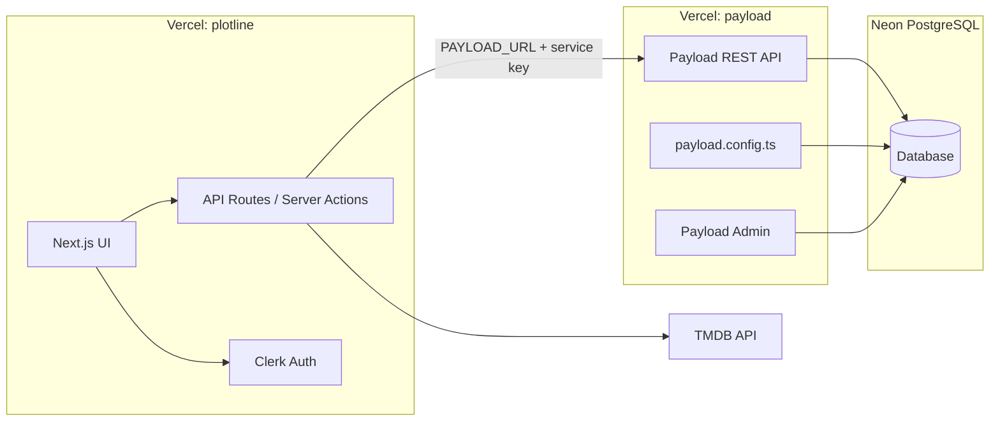
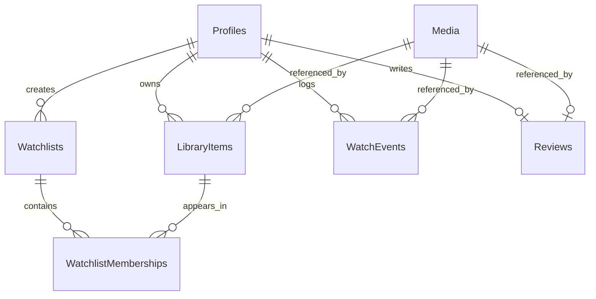
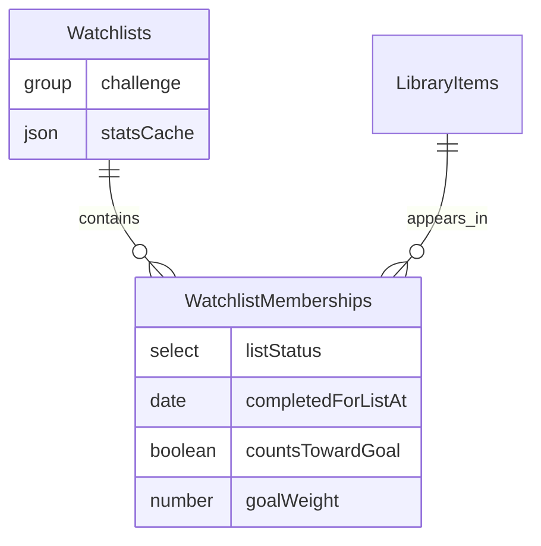

# Plotline Turbo Monorepo Setup Plan

## Context

The workspace at [`c:\Users\chris\workspace\plotline`](c:\Users\chris\workspace\plotline) is **empty (greenfield)**. This plan scaffolds the full monorepo foundation, wires cross-app integration patterns, and documents deployment — without implementing every Plotline feature upfront.

**Confirmed decisions:**

- **Database:** PostgreSQL (Neon recommended for Vercel)
- **Deployment:** Two separate Vercel projects (`plotline` + `payload`)

**Key architectural constraint (Payload 3):** Payload runs inside Next.js. Because `apps/plotline` is a separate Next.js app, it **cannot** use Payload's Local API directly. User data flows through **Plotline BFF routes** (Clerk-authenticated) that call **Payload REST API** on the payload app.



---

## Target Repository Structure

```
plotline/
├── apps/
│   ├── payload/                 # @plotline/payload — CMS + admin + REST API
│   └── plotline/                # @plotline/plotline — user-facing Next.js app
├── packages/
│   ├── eslint-config/           # @plotline/eslint-config
│   ├── shared/                  # @plotline/shared — TMDB client, zod schemas, utils
│   ├── payload-types/           # @plotline/payload-types — generated Payload types
│   └── typescript-config/       # @plotline/typescript-config — shared tsconfigs
├── docs/
│   ├── deployment.md
│   └── architecture.md
├── .github/workflows/ci.yml
├── docker-compose.yml             # local Postgres
├── turbo.json
├── pnpm-workspace.yaml
├── package.json
├── STYLE_GUIDE.md
├── README.md
└── .env.example
```

Package scope: **`@plotline/*`** (consistent branding; adjustable if you prefer `@repo/*`).

---

## Phase 1: Monorepo Foundation

### 1.1 Initialize workspace

From repo root:

```bash
pnpm init
```

Create [`pnpm-workspace.yaml`](pnpm-workspace.yaml):

```yaml
packages:
  - "apps/*"
  - "packages/*"
```

Root [`package.json`](package.json) scripts:

| Script              | Purpose                                               |
| ------------------- | ----------------------------------------------------- |
| `dev`               | `turbo run dev` — both apps concurrently              |
| `build`             | `turbo run build`                                     |
| `lint`              | `turbo run lint -- --fix`                             |
| `typecheck`         | `turbo run typecheck`                                 |
| `generate:types`    | `turbo run generate:types --filter=@plotline/payload` |
| `db:up` / `db:down` | docker-compose Postgres lifecycle                     |

### 1.2 Turborepo config

[`turbo.json`](turbo.json) task graph:

- **`build`**: `dependsOn: ["^build"]`, outputs `[".next/**", "dist/**"]`
- **`dev`**: `cache: false`, `persistent: true`
- **`lint`**: no deps (or `dependsOn: ["^build"]` if needed)
- **`typecheck`**: `dependsOn: ["^build", "generate:types"]`
- **`generate:types`**: outputs `packages/payload-types/src/**`, `cache: false`

Pass env vars to build tasks: `DATABASE_URL`, `PAYLOAD_SECRET`, `NEXT_PUBLIC_*`, `CLERK_*`, `SENTRY_*`.

### 1.3 Shared TypeScript config package

Create [`packages/typescript-config/`](packages/typescript-config/) with:

- `base.json` — strict ES2022, `moduleResolution: bundler`, `noUncheckedIndexedAccess`
- `nextjs.json` — extends base, Next.js plugin paths
- `react-library.json` — for `shared` package

Each app/package extends the appropriate config via `"extends": "@plotline/typescript-config/nextjs.json"`.

### 1.4 Local Postgres

[`docker-compose.yml`](docker-compose.yml):

- Postgres 16 on port `5432`
- Volume + healthcheck
- Credentials documented in [`.env.example`](.env.example)

---

## Phase 2: Shared Packages

### 2.1 `@plotline/eslint-config`

Flat ESLint 9 config package exporting:

- **`base.js`** — `@eslint/js`, `typescript-eslint`, `eslint-config-prettier`
- **`next.js`** — extends base + `@next/eslint-plugin-next`, React hooks rules
- **`payload.js`** — extends next with Payload-specific allowances (e.g. default exports in config files)

Each workspace package [`eslint.config.mjs`](apps/plotline/eslint.config.mjs) imports and spreads the shared config. Root runs `pnpm exec turbo run lint -- --fix`.

### 2.2 `@plotline/payload-types`

Generated-only package (no hand-written domain logic):

```
packages/payload-types/
├── package.json        # "main": "./src/index.ts", "types": "./src/index.ts"
├── src/index.ts        # generated by Payload
└── README.md           # "Do not edit manually; run pnpm generate:types"
```

Payload config in `apps/payload` points type output here:

```typescript
typescript: {
  outputFile: path.resolve(dirname, '../../packages/payload-types/src/index.ts'),
  declare: false,
},
```

Add a `generate:types` script in payload app: `payload generate:types`.

Both apps depend on `@plotline/payload-types` for typed REST responses and collection shapes.

### 2.3 `@plotline/shared`

Initial exports (stubs with real structure, minimal implementation):

| Module                      | Purpose                                                                                                             |
| --------------------------- | ------------------------------------------------------------------------------------------------------------------- |
| `tmdb/client.ts`            | Typed fetch wrapper for TMDB v3 (`TMDB_API_KEY`)                                                                    |
| `tmdb/schemas.ts`           | Zod schemas for movie/TV search + details                                                                           |
| `constants/media-status.ts` | `MediaStatus`, `MediaType`, `WatchEventType`, `Visibility`, `StreamingPlatform` enums (mirrored in Payload configs) |
| `utils/dates.ts`            | Release calendar helpers                                                                                            |
| `env.ts`                    | Shared env validation pattern (optional, using `@t3-oss/env-core`)                                                  |

Document in [`packages/shared/README.md`](packages/shared/README.md) that TMDB responses are cached into Payload `media` collection by the payload app hooks/jobs.

---

## Phase 3: Payload Backend App (`apps/payload`)

### 3.1 Scaffold

Use Payload's Postgres template as the starting point:

```bash
pnpm dlx create-payload-app@latest apps/payload --template with-postgres
```

Then adapt to monorepo conventions (workspace package names, shared tsconfig/eslint, move collections into organized folders).

### 3.2 Core dependencies

- `@payloadcms/next`, `@payloadcms/db-postgres`, `@payloadcms/richtext-lexical`
- `@plotline/payload-types`, `@plotline/shared`, `@plotline/eslint-config`, `@plotline/typescript-config`

### 3.3 Payload data model (MVP)

MVP uses a **LibraryItem hub + WatchEvent log + Watchlist membership** pattern:

- **`library-items`** — one row per `(profile, media)`; holds status, progress, and personal notes
- **`watchlists` + `watchlist-memberships`** — organizational only; no duplicated progress
- **`watch-events`** — append-only activity log; powers timeline, stats, and Year in Review later
- **`reviews`** — one rating/review per `(profile, media)`
- **`media`** — shared TMDB cache; read by all users, written by service/admin only



**File layout** in [`apps/payload/src/collections/`](apps/payload/src/collections/):

```
collections/
├── Users.ts                  # Payload admin (from template)
├── Profiles.ts
├── Media.ts
├── LibraryItems.ts
├── Watchlists.ts
├── WatchlistMemberships.ts
├── WatchEvents.ts
└── Reviews.ts
```

Shared helpers in [`apps/payload/src/access/`](apps/payload/src/access/):

- `isAdmin.ts` — Payload `users` role check
- `isOwner.ts` — compares `req.context.profileId` to doc `profile` field
- `resolveProfileFromRequest.ts` — maps `x-clerk-user-id` header → profile ID (set by Plotline BFF)

**Clerk ↔ Payload sync:** webhook at [`apps/payload/src/app/api/webhooks/clerk/route.ts`](apps/payload/src/app/api/webhooks/clerk/route.ts) upserts `profiles` on `user.created` / `user.updated`. On first profile creation, a hook seeds default watchlists.

---

#### Collection: `users` (Payload admin — template default)

| Field   | Type           | Required | Notes              |
| ------- | -------------- | -------- | ------------------ |
| `email` | email          | yes      | Login for `/admin` |
| `roles` | select (multi) | yes      | `admin`, `editor`  |

Access: admin-only. Not used for Plotline app users.

---

#### Collection: `profiles`

App users synced from Clerk. Primary identity for all user-owned data.

| Field                               | Type     | Required | Indexed | Notes                                                                                                                              |
| ----------------------------------- | -------- | -------- | ------- | ---------------------------------------------------------------------------------------------------------------------------------- |
| `clerkUserId`                       | text     | yes      | unique  | Lookup key from BFF (`x-clerk-user-id`)                                                                                            |
| `username`                          | text     | yes      | unique  | Shareable URL slug; derived from Clerk on sync                                                                                     |
| `displayName`                       | text     | yes      |         | From Clerk `firstName` + `lastName`                                                                                                |
| `avatarUrl`                         | text     | no       |         | From Clerk `imageUrl`                                                                                                              |
| `bio`                               | textarea | no       |         |                                                                                                                                    |
| `preferences`                       | group    | no       |         | See sub-fields below                                                                                                               |
| `preferences.defaultListVisibility` | select   | no       |         | `private` (default), `friends`, `public`, `unlisted`                                                                               |
| `preferences.spoilersHidden`        | checkbox | no       |         | Default `true`                                                                                                                     |
| `preferences.region`                | text     | no       |         | ISO region for streaming (default `US`)                                                                                            |
| `privacySettings`                   | group    | no       |         |                                                                                                                                    |
| `privacySettings.showActivity`      | checkbox | no       |         | Default `true`                                                                                                                     |
| `privacySettings.showRatings`       | checkbox | no       |         | Default `true`                                                                                                                     |
| `statsCache`                        | json     | no       |         | Denormalized profile rollups; typed via `jsonSchema` — see [JSON schema convention](#json-schema-convention-for-statscache-fields) |

**Unique constraints:** `clerkUserId`, `username`

**Hooks:**

- `afterChange` (create): seed default watchlists (`Watchlist`, `Currently Watching`)
- `beforeValidate`: normalize `username` to lowercase slug

**Access:**

- Read: owner OR public fields only for other users (future social)
- Create: service role (Clerk webhook) only
- Update: owner (via BFF) OR service role
- Delete: service role only (account deletion flow)

---

#### Collection: `media`

Shared TMDB catalog cache. One doc per `(tmdbId, mediaType)`.

| Field                      | Type     | Required    | Indexed   | Notes                                                 |
| -------------------------- | -------- | ----------- | --------- | ----------------------------------------------------- |
| `tmdbId`                   | number   | yes         | composite | TMDB ID                                               |
| `mediaType`                | select   | yes         | composite | `movie` \| `tv`                                       |
| `title`                    | text     | yes         |           | Primary display name                                  |
| `originalTitle`            | text     | no          |           |                                                       |
| `overview`                 | textarea | no          |           |                                                       |
| `tagline`                  | text     | no          |           | Movies only                                           |
| `posterPath`               | text     | no          |           | TMDB path segment                                     |
| `backdropPath`             | text     | no          |           |                                                       |
| `releaseDate`              | date     | no          | yes       | Theatrical / first air date                           |
| `decade`                   | number   | no          | yes       | Computed in `beforeChange` from `releaseDate`         |
| `status`                   | select   | no          |           | `released`, `upcoming`, `cancelled`, `in_production`  |
| `runtime`                  | number   | no          |           | Minutes; episode runtime for TV                       |
| `genres`                   | array    | no          |           | `{ id: number, name: text }[]` — for habit breakdowns |
| `popularity`               | number   | no          |           | TMDB popularity score                                 |
| `voteAverage`              | number   | no          |           | TMDB community rating                                 |
| `tvMeta`                   | group    | conditional |           | Only when `mediaType === 'tv'`                        |
| `tvMeta.seasonCount`       | number   | no          |           |                                                       |
| `tvMeta.episodeCount`      | number   | no          |           | Total aired episodes                                  |
| `tvMeta.inProduction`      | checkbox | no          |           |                                                       |
| `tvMeta.nextEpisodeDate`   | date     | no          | yes       | Powers release calendar queries                       |
| `tvMeta.nextEpisodeSeason` | number   | no          |           |                                                       |
| `tvMeta.nextEpisodeNumber` | number   | no          |           |                                                       |
| `externalIds`              | group    | no          |           |                                                       |
| `externalIds.imdbId`       | text     | no          |           |                                                       |
| `externalIds.tvdbId`       | number   | no          |           |                                                       |
| `metadataSyncedAt`         | date     | no          |           | Stale-data detection for refresh jobs                 |
| `searchKeywords`           | text     | no          | yes       | Denormalized title + originalTitle for admin search   |

**Unique constraint:** `(tmdbId, mediaType)`

**Hooks:**

- `beforeChange`: compute `decade` from `releaseDate`; update `searchKeywords`
- `beforeValidate`: reject duplicate `(tmdbId, mediaType)`

**Access:**

- Read: public (all authenticated + anonymous via BFF)
- Create/Update: service role or admin (TMDB upsert endpoint)
- Delete: admin only

**TMDB upsert:** custom endpoint [`apps/payload/src/endpoints/tmdb-upsert.ts`](apps/payload/src/endpoints/tmdb-upsert.ts) called by Plotline BFF after TMDB search/detail fetch.

---

#### Collection: `library-items`

Core user↔title relationship. **One row per `(profile, media)`.**

| Field                       | Type                    | Required    | Indexed | Notes                                                    |
| --------------------------- | ----------------------- | ----------- | ------- | -------------------------------------------------------- |
| `profile`                   | relationship → profiles | yes         | yes     |                                                          |
| `media`                     | relationship → media    | yes         | yes     |                                                          |
| `status`                    | select                  | yes         | yes     | `planned`, `watching`, `completed`, `dropped`, `on_hold` |
| `progress`                  | group                   | yes         |         | Discriminated by media type — see below                  |
| `progress.type`             | select                  | yes         |         | `movie` \| `tv`                                          |
| `progress.watched`          | checkbox                | conditional |         | When `type === 'movie'`                                  |
| `progress.lastSeason`       | number                  | conditional |         | When `type === 'tv'`                                     |
| `progress.lastEpisode`      | number                  | conditional |         | When `type === 'tv'`                                     |
| `progress.episodesWatched`  | number                  | conditional |         | Denormalized count                                       |
| `progress.seasonsCompleted` | number[]                | conditional |         | e.g. `[1, 2]`                                            |
| `startedAt`                 | date                    | no          |         | Set when status → `watching`                             |
| `completedAt`               | date                    | no          |         | Set when status → `completed`                            |
| `lastWatchedAt`             | date                    | no          | yes     | Updated from watch-events                                |
| `rewatchCount`              | number                  | no          |         | Default `0`; increment on rewatch                        |
| `personalNotes`             | textarea                | no          |         | Private user notes                                       |
| `source`                    | select                  | no          |         | `manual`, `import`, `recommendation`                     |

**Unique constraint:** `(profile, media)`

**Hooks:**

- `beforeChange`: auto-set `startedAt` / `completedAt` on status transitions
- `afterChange`: when status → `completed`, optionally emit a `watch-events` doc with `eventType: completed`

**Access:** CRUD restricted to owning profile (via `isOwner`)

**Admin UI:** use `admin.defaultColumns: ['media', 'status', 'lastWatchedAt']`; relationship filter on `profile`.

---

#### Collection: `watchlists`

Named lists for organizing library items. Supports future shareable lists via `visibility`.

| Field         | Type                    | Required | Indexed   | Notes                                                |
| ------------- | ----------------------- | -------- | --------- | ---------------------------------------------------- |
| `owner`       | relationship → profiles | yes      | yes       |                                                      |
| `name`        | text                    | yes      |           | Display name                                         |
| `slug`        | text                    | yes      | composite | URL-safe; unique per owner                           |
| `description` | textarea                | no       |           |                                                      |
| `visibility`  | select                  | yes      |           | `private` (default), `friends`, `public`, `unlisted` |
| `isDefault`   | checkbox                | no       |           | System lists cannot be deleted                       |
| `isSystem`    | checkbox                | no       |           | `true` for seeded lists                              |
| `sortOrder`   | number                  | no       |           | Display ordering                                     |
| `coverMedia`  | relationship → media    | no       |           | Optional list cover image                            |

**Unique constraint:** `(owner, slug)`

**Default seeded lists** (on profile create):

| name               | slug               | isSystem | isDefault |
| ------------------ | ------------------ | -------- | --------- |
| Watchlist          | watchlist          | true     | true      |
| Currently Watching | currently-watching | true     | true      |

**Access:**

- Read: owner always; public/unlisted readable by slug (future)
- Create/Update/Delete: owner; system lists cannot be deleted (`beforeDelete` hook)

---

#### Collection: `watchlist-memberships`

Join table linking library items to watchlists. **No global status/progress here** (MVP). Post-MVP challenge expansion adds list-scoped fields — see [Phase 3.7](#37-challenge-mode-watchlists-post-mvp-expansion).

| Field         | Type                         | Required | Indexed | Notes                                 |
| ------------- | ---------------------------- | -------- | ------- | ------------------------------------- |
| `watchlist`   | relationship → watchlists    | yes      | yes     |                                       |
| `libraryItem` | relationship → library-items | yes      | yes     | depth 1 populates media               |
| `addedAt`     | date                         | yes      |         | Default `now`                         |
| `sortOrder`   | number                       | no       |         | Manual ordering within list           |
| `note`        | text                         | no       |         | List-specific note ("watch with Sam") |

**Unique constraint:** `(watchlist, libraryItem)`

**Hooks:**

- `beforeValidate`: verify `libraryItem.profile === watchlist.owner` (same owner)

**Access:** same as parent watchlist (owner via `watchlist.owner`)

**Add-to-list flow** (implemented in BFF or custom endpoint):

1. Upsert `library-item` for `(profile, media)` with status `planned` if new
2. Create `watchlist-membership` linking item to target list

---

#### Collection: `watch-events`

Append-only activity log. Analytics backbone for timeline, stats, Year in Review.

| Field               | Type                         | Required    | Indexed | Notes                                                                                         |
| ------------------- | ---------------------------- | ----------- | ------- | --------------------------------------------------------------------------------------------- |
| `profile`           | relationship → profiles      | yes         | yes     |                                                                                               |
| `media`             | relationship → media         | yes         | yes     |                                                                                               |
| `libraryItem`       | relationship → library-items | no          |         | Link when event updates library state                                                         |
| `eventType`         | select                       | yes         | yes     | `started`, `progress`, `completed`, `rewatched`, `dropped`, `on_hold`                         |
| `watchedAt`         | date                         | yes         | yes     | When viewing occurred                                                                         |
| `platform`          | select                       | no          | yes     | `netflix`, `disney_plus`, `hulu`, `max`, `apple_tv`, `amazon`, `theater`, `physical`, `other` |
| `platformOther`     | text                         | conditional |         | When `platform === 'other'`                                                                   |
| `runtimeMinutes`    | number                       | no          |         | For "hours watched" stats                                                                     |
| `tvContext`         | group                        | conditional |         | When media is TV                                                                              |
| `tvContext.season`  | number                       | no          |         |                                                                                               |
| `tvContext.episode` | number                       | no          |         |                                                                                               |
| `isRewatch`         | checkbox                     | no          |         | Default `false`                                                                               |
| `visibility`        | select                       | yes         |         | `private` (default), `friends`, `public`                                                      |

**Recommended indexes:** `(profile, watchedAt DESC)`, `(profile, media)`

**Hooks (`afterChange` on create):**

1. Update linked `library-item.lastWatchedAt`
2. For TV `progress` events: bump `library-item.progress.lastSeason/lastEpisode/episodesWatched`
3. Invalidate `profile.statsCache`

**Access:**

- Read: owner; future friends-only via visibility
- Create: owner (via BFF)
- Update: disallowed (immutable log) — use admin override only
- Delete: owner or admin (for GDPR account deletion)

---

#### Collection: `reviews`

One review per `(profile, media)`. Rating required; written review optional.

| Field              | Type                    | Required | Indexed | Notes                                           |
| ------------------ | ----------------------- | -------- | ------- | ----------------------------------------------- |
| `profile`          | relationship → profiles | yes      | yes     |                                                 |
| `media`            | relationship → media    | yes      | yes     |                                                 |
| `rating`           | number                  | yes      |         | 0.5–10 in 0.5 steps (validate in hook)          |
| `title`            | text                    | no       |         | Review headline                                 |
| `body`             | richText (Lexical)      | no       |         | Long-form review                                |
| `containsSpoilers` | checkbox                | no       |         | Default `false`                                 |
| `watchedAt`        | date                    | no       |         | When they watched (may differ from review date) |
| `visibility`       | select                  | yes      |         | `private`, `friends`, `public`                  |

**Unique constraint:** `(profile, media)`

**Access:** CRUD restricted to owning profile

---

#### MVP access control summary

| Collection              | Read                                 | Create            | Update          | Delete             |
| ----------------------- | ------------------------------------ | ----------------- | --------------- | ------------------ |
| `users`                 | admin                                | admin             | admin           | admin              |
| `profiles`              | owner (+ public subset later)        | service (webhook) | owner / service | service            |
| `media`                 | public                               | service / admin   | service / admin | admin              |
| `library-items`         | owner                                | owner             | owner           | owner              |
| `watchlists`            | owner (+ public by visibility later) | owner             | owner           | owner (non-system) |
| `watchlist-memberships` | owner                                | owner             | owner           | owner              |
| `watch-events`          | owner                                | owner             | none            | owner / admin      |
| `reviews`               | owner (+ public by visibility later) | owner             | owner           | owner              |

**BFF auth pattern:** Plotline passes `Authorization: Bearer ${PAYLOAD_API_KEY}` plus `x-clerk-user-id: ${userId}`. Payload custom endpoint middleware resolves `profileId` into `req.context.profileId` before access functions run.

---

#### MVP custom endpoints

| Endpoint                   | Method | Purpose                                            |
| -------------------------- | ------ | -------------------------------------------------- |
| `/api/webhooks/clerk`      | POST   | Sync profiles from Clerk                           |
| `/api/tmdb/upsert`         | POST   | Upsert media from TMDB payload (service auth)      |
| `/api/library/add-to-list` | POST   | Upsert library-item + create membership atomically |
| `/api/library/log-watch`   | POST   | Create watch-event + update library-item progress  |

These endpoints live under [`apps/payload/src/endpoints/`](apps/payload/src/endpoints/) and are registered in [`payload.config.ts`](apps/payload/src/payload.config.ts).

---

#### Shared constants (mirror in `@plotline/shared`)

Define enums in [`packages/shared/src/constants/media.ts`](packages/shared/src/constants/media.ts) and import in collection configs to keep Payload + Plotline in sync:

- `MediaStatus`: planned, watching, completed, dropped, on_hold
- `MediaType`: movie, tv
- `WatchEventType`: started, progress, completed, rewatched, dropped, on_hold
- `Visibility`: private, friends, public, unlisted
- `StreamingPlatform`: netflix, disney_plus, hulu, max, apple_tv, amazon, theater, physical, other

---

#### Post-MVP collections (document only, not built in setup)

| Collection               | Purpose                             |
| ------------------------ | ----------------------------------- |
| `friendships`            | Social graph                        |
| `activity-items`         | Denormalized friend feed            |
| `streaming-availability` | Volatile provider data by region    |
| `stats-snapshots`        | Materialized Year in Review rollups |
| `recommendation-cache`   | Precomputed suggestions             |
| `profile-media-follows`  | Release-date notifications          |

**Challenge-mode watchlists** are not a new collection — they extend `watchlists` and `watchlist-memberships` (see [Phase 3.7](#37-challenge-mode-watchlists-post-mvp-expansion)).

These are listed in [`docs/architecture.md`](docs/architecture.md) roadmap section.

---

### 3.7 Challenge-mode watchlists (post-MVP expansion)

Tracked by todo **`challenge-watchlists`**. Builds on the LibraryItem hub pattern: global progress stays on `library-items`; list-scoped attribution and pacing live on watchlists + memberships.



#### Design principles

- **Regular lists:** `challenge.enabled === false`; stats are informational (counts, genres, runtime remaining).
- **Challenge lists:** optional `dueDate`, goal type (count or runtime), TV counting rules, and pacing metrics (days left, required per day).
- **List-scoped completion:** `watchlist-memberships.listStatus` tracks what counts _for this list_; `library-items.status` remains global truth.
- **Derived metrics:** `requiredPerDay`, `onTrack`, etc. are computed — stored only in `statsCache` for read performance.

---

#### Extend collection: `watchlists`

Add fields to [`apps/payload/src/collections/watchlists/index.ts`](apps/payload/src/collections/watchlists/index.ts):

**`challenge` group** (shown when `challenge.enabled`):

| Field                           | Type     | Notes                                                                                          |
| ------------------------------- | -------- | ---------------------------------------------------------------------------------------------- |
| `challenge.enabled`             | checkbox | Default `false`; toggles challenge UI and pacing                                               |
| `challenge.startDate`           | date     | Default to watchlist `createdAt` if unset                                                      |
| `challenge.dueDate`             | date     | Required when enabled; drives days-remaining math                                              |
| `challenge.goalType`            | select   | `count` \| `runtime_minutes`                                                                   |
| `challenge.goalCount`           | number   | Target count when `goalType === 'count'` (optional cap; defaults to eligible membership count) |
| `challenge.goalRuntimeMinutes`  | number   | Target when `goalType === 'runtime_minutes'`                                                   |
| `challenge.tvCountRule`         | select   | How TV titles contribute — see TV rules below                                                  |
| `challenge.priorCompletionRule` | select   | `exclude_if_already_completed` \| `count_if_completed_after_join` \| `count_all_on_join`       |
| `challenge.includeRewatches`    | checkbox | Default `false`                                                                                |

**TV counting rules (`challenge.tvCountRule`):**

| Value           | Behavior                                                                                                            |
| --------------- | ------------------------------------------------------------------------------------------------------------------- |
| `movies_only`   | TV memberships excluded from goal denominator and progress                                                          |
| `tv_as_series`  | One TV series counts as 1 unit when list-scoped status is `completed`                                               |
| `tv_by_episode` | Progress weighted by episodes (`goalWeight` derived from `library-items.progress.episodesWatched` delta since join) |
| `tv_by_season`  | One season completed counts as 1 unit (uses `library-items.progress.seasonsCompleted`)                              |

**Runtime goals (`goalType === 'runtime_minutes'`):**

- `goalWeight` on each membership defaults to `media.runtime` (movies) or remaining episode runtime estimate for in-progress TV.
- Completed progress subtracts watched runtime from `goalRuntimeMinutes` remaining.
- Hooks recalculate when `library-items.progress` or `media.runtime` changes.

**`statsCache` json field:**

| Field        | Type | Notes                                                                                       |
| ------------ | ---- | ------------------------------------------------------------------------------------------- |
| `statsCache` | json | Denormalized list/challenge stats; admin read-only; invalidated by membership/library hooks |

Schema defined in [`apps/payload/src/collections/watchlists/stats-cache.schema.ts`](apps/payload/src/collections/watchlists/stats-cache.schema.ts) and wired via `jsonSchema` (see convention below).

**`statsCache` shape (JSON Schema enforced):**

```typescript
{
  totalEligible: number
  completed: number
  inProgress: number
  remaining: number
  percentComplete: number
  // count goals
  goalCount?: number
  // runtime goals
  goalRuntimeMinutes?: number
  completedRuntimeMinutes?: number
  remainingRuntimeMinutes?: number
  // pacing (challenge only)
  daysTotal?: number
  daysElapsed?: number
  daysRemaining?: number
  requiredPerDay?: number       // remaining / daysRemaining
  actualPerDay?: number         // completed / daysElapsed
  onTrack?: boolean
  projectedFinishDate?: string  // ISO date
  status?: 'not_started' | 'active' | 'completed' | 'overdue'
  lastCalculatedAt: string      // ISO datetime
}
```

**New hooks** in [`apps/payload/src/collections/watchlists/hooks/`](apps/payload/src/collections/watchlists/hooks/):

- `recalculateStats.ts` — called after membership or library-item changes affecting this list
- `beforeValidate.ts` — require `dueDate` when `challenge.enabled`; validate `goalCount` / `goalRuntimeMinutes` for goal type

**New endpoint:** `POST /api/watchlists/:id/recalculate-stats` (service auth + owner)

---

#### Extend collection: `watchlist-memberships`

Add list-scoped fields to [`apps/payload/src/collections/watchlist-memberships/index.ts`](apps/payload/src/collections/watchlist-memberships/index.ts):

| Field                    | Type     | Default   | Notes                                                           |
| ------------------------ | -------- | --------- | --------------------------------------------------------------- |
| `listStatus`             | select   | `planned` | `planned`, `in_progress`, `completed`, `skipped`                |
| `completedForListAt`     | date     |           | Set when list-scoped completion occurs                          |
| `countsTowardGoal`       | checkbox | `true`    | `false` for excluded TV, prior completions, or skipped items    |
| `goalWeight`             | number   | `1`       | Units toward count goal, or runtime minutes toward runtime goal |
| `episodesCountedForList` | number   | `0`       | For `tv_by_episode` challenges only                             |

**New hooks:**

- `afterChange` / sync from [`library-items/hooks/afterChange.ts`](apps/payload/src/collections/library-items/hooks/afterChange.ts): when global status → `completed`, update memberships using parent watchlist `priorCompletionRule`
- `beforeValidate`: set initial `countsTowardGoal` and `goalWeight` from watchlist challenge config + media type on create

---

#### JSON schema convention for `statsCache` fields

All `statsCache` json fields **must** use Payload's `jsonSchema` field option (Ajv validation on save + typed admin editor + improved generated types). The JSON Schema object lives in a **separate file colocated** with the collection config — not inline in `index.ts`.

**File layout:**

```
collections/watchlists/
├── index.ts
├── access.ts
├── stats-cache.schema.ts      # exports watchlistStatsCacheSchema + uri constants
└── hooks/
    └── recalculateStats.ts

collections/profiles/
├── index.ts
├── stats-cache.schema.ts      # exports profileStatsCacheSchema (retrofit existing field)
└── hooks/
```

**Colocated schema file pattern:**

```typescript
// apps/payload/src/collections/watchlists/stats-cache.schema.ts
import type { JSONSchema4 } from "json-schema";

export const WATCHLIST_STATS_CACHE_URI =
  "plotline://schemas/watchlist-stats-cache.json";

export const watchlistStatsCacheSchema: JSONSchema4 = {
  type: "object",
  additionalProperties: false,
  properties: {
    totalEligible: { type: "number" },
    completed: { type: "number" },
    // ...full shape from statsCache table above
    lastCalculatedAt: { type: "string", format: "date-time" },
  },
  required: [
    "totalEligible",
    "completed",
    "remaining",
    "percentComplete",
    "lastCalculatedAt",
  ],
};
```

**Collection field wiring:**

```typescript
import { watchlistStatsCacheSchema, WATCHLIST_STATS_CACHE_URI } from './stats-cache.schema'

{
  name: 'statsCache',
  type: 'json',
  admin: { readOnly: true },
  jsonSchema: {
    uri: WATCHLIST_STATS_CACHE_URI,
    fileMatch: [WATCHLIST_STATS_CACHE_URI],
    schema: watchlistStatsCacheSchema,
  },
}
```

Apply the same pattern when retrofitting [`profiles.statsCache`](apps/payload/src/collections/profiles/index.ts) (currently untyped json).

---

#### Shared stats helpers (`@plotline/shared`)

Add [`packages/shared/src/watchlist-stats/`](packages/shared/src/watchlist-stats/):

| Module                      | Purpose                                                                                    |
| --------------------------- | ------------------------------------------------------------------------------------------ |
| `computeWatchlistStats.ts`  | Pure function: memberships + library-items + media + challenge config → `statsCache` shape |
| `computeChallengePacing.ts` | Days remaining, required/day, on-track, projected finish                                   |
| `applyTvCountRule.ts`       | Filter/weight memberships by `tvCountRule`                                                 |
| `types.ts`                  | TypeScript types mirroring JSON schemas (imported by Plotline BFF)                         |

Used by Payload hooks, `recalculate-stats` endpoint, and Plotline BFF `GET /api/watchlists/:slug/stats`.

---

#### Plotline BFF (when `plotline-app` implements list UI)

- `GET /api/watchlists/:slug/stats` — returns computed or cached stats
- Challenge list UI: progress bar, days left, required/day, on-track badge, overdue state
- Document challenge flows in [`docs/architecture.md`](docs/architecture.md)

---

#### Implementation order (challenge-watchlists todo)

1. Add colocated JSON schema files + wire `jsonSchema` on `watchlists.statsCache`; retrofit `profiles.statsCache`
2. Add `challenge` group fields to `watchlists`
3. Add list-scoped fields to `watchlist-memberships`
4. Implement `@plotline/shared` stats helpers (count + runtime + all TV rules)
5. Add sync hooks (library-item → memberships) + `recalculateStats` on watchlists
6. Add `recalculate-stats` endpoint; run `pnpm generate:types`
7. Update [`docs/architecture.md`](docs/architecture.md) and payload README with challenge model

### 3.4 Payload REST + CORS

- Enable CORS for `PLOTLINE_URL` (production + preview URLs)
- Document `PAYLOAD_SECRET`, `DATABASE_URL`, `PAYLOAD_API_KEY` (custom API key for server-to-server calls from plotline BFF)

### 3.5 Sentry (payload app)

Follow [`@sentry/nextjs`](https://docs.sentry.io/platforms/javascript/guides/nextjs/) wizard scoped to `apps/payload`:

- `instrumentation.ts`, `sentry.server.config.ts`, `sentry.edge.config.ts`
- Wrap `next.config.ts` with `withSentryConfig`
- Env: `SENTRY_DSN`, `SENTRY_AUTH_TOKEN` (CI/build only)

### 3.6 Payload app docs

[`apps/payload/README.md`](apps/payload/README.md) covers:

- Local dev (`pnpm dev --filter=@plotline/payload`)
- Admin URL (`/admin`)
- Collection overview
- Type generation workflow
- Env vars table
- Vercel deploy steps (root directory: `apps/payload`)

---

## Phase 4: Plotline Frontend App (`apps/plotline`)

### 4.1 Scaffold

```bash
pnpm dlx create-next-app@latest apps/plotline --typescript --tailwind --eslint --app --src-dir --import-alias "@/*"
```

Wire workspace deps: `@plotline/shared`, `@plotline/payload-types`, `@plotline/eslint-config`, `@plotline/typescript-config`.

### 4.1.1 shadcn/ui design system (preset `b4XvrpuTqd`)

Plotline uses a fixed shadcn/ui preset for all UI work. The preset encodes theme colors, fonts, radius, icon library, and other design tokens as a single shareable code — do not hand-pick alternate shadcn themes in the plotline app.

**Initialize** (non-interactive, from repo root):

```bash
pnpm dlx shadcn@latest init --preset b4XvrpuTqd --pointer -d -f -c apps/plotline
```

| Flag                  | Purpose                                                                     |
| --------------------- | --------------------------------------------------------------------------- |
| `--preset b4XvrpuTqd` | Apply the chosen design system (colors, fonts, radius, icons)               |
| `--pointer`           | Enable `cursor: pointer` on `<Button>` and button-like interactive elements |
| `-d`                  | Non-interactive defaults (required for CI/agents)                           |
| `-f`                  | Overwrite existing shadcn config if re-running                              |
| `-c apps/plotline`    | Scope init to the plotline app                                              |

**Expected outputs** in [`apps/plotline/`](apps/plotline/):

| File                                                       | Purpose                                         |
| ---------------------------------------------------------- | ----------------------------------------------- |
| [`components.json`](apps/plotline/components.json)         | shadcn config; records preset + pointer setting |
| [`src/lib/utils.ts`](apps/plotline/src/lib/utils.ts)       | `cn()` helper                                   |
| [`src/app/globals.css`](apps/plotline/src/app/globals.css) | CSS variables from preset theme                 |
| [`src/components/ui/`](apps/plotline/src/components/ui/)   | Installed base components                       |

**MVP component set** (install after init):

```bash
pnpm dlx shadcn@latest add button card input label dropdown-menu dialog avatar badge separator skeleton tabs -c apps/plotline
```

New UI in plotline must compose from `@/components/ui/*` — do not introduce parallel component libraries (MUI, Chakra, etc.).

**Preset maintenance:**

- Inspect preset: `pnpm dlx shadcn@latest preset decode b4XvrpuTqd` (optional; for docs only)
- Re-apply full preset later: `pnpm dlx shadcn@latest apply --preset b4XvrpuTqd --pointer -c apps/plotline`
- Document preset code in [`apps/plotline/README.md`](apps/plotline/README.md) and [`STYLE_GUIDE.md`](STYLE_GUIDE.md) so the team and agents stay aligned

**Scope:** shadcn/ui applies to **`apps/plotline` only**. The Payload admin app keeps its default Payload UI — no shared design-system package needed for MVP.

### 4.2 Clerk authentication

Follow current App Router patterns (`clerk-setup` + `clerk-nextjs-patterns` skills):

1. **`proxy.ts`** (or `middleware.ts` on older Next) with `clerkMiddleware()` — protected-first strategy for `/dashboard`, `/watchlists`, `/settings`; public routes for marketing/landing
2. **`app/layout.tsx`** — wrap with `<ClerkProvider>`
3. Sign-in/up routes via Clerk components or hosted pages
4. Server Components / Server Actions use `await auth()` from `@clerk/nextjs/server`

Env vars:

```
NEXT_PUBLIC_CLERK_PUBLISHABLE_KEY=
CLERK_SECRET_KEY=
CLERK_WEBHOOK_SECRET=          # payload app webhook verification
```

### 4.3 Payload integration layer (BFF)

Create [`apps/plotline/src/lib/payload/`](apps/plotline/src/lib/payload/):

- `client.ts` — server-only fetch to `PAYLOAD_URL/api/...` with `Authorization` header
- `queries/` — typed wrappers using `@plotline/payload-types` (`getWatchlists`, `addToList`, `logWatchEvent`, `upsertReview`, etc.)
- Route handlers under `app/api/` that:
  1. Verify Clerk session
  2. Resolve `clerkUserId`
  3. Call Payload REST with service credentials + user-scoped filters

This is the integration point for all future features (watchlists, stats, Year in Review, recommendations).

### 4.4 TMDB integration

- Server-side only calls via `@plotline/shared/tmdb`
- Search/detail routes in plotline; on selection, payload app upserts `Media` records
- Env: `TMDB_API_KEY`, `TMDB_READ_ACCESS_TOKEN` (if using v4)

### 4.5 Sentry (plotline app)

Same `@sentry/nextjs` setup as payload app, separate Sentry project (or environment tags within one project).

Optional: enable Session Replay + tracing in dev at 100%, prod at ~10%.

### 4.6 Initial UI shell (deployable MVP)

Minimal routes proving the stack works:

| Route                  | Purpose                                    |
| ---------------------- | ------------------------------------------ |
| `/`                    | Landing / marketing stub                   |
| `/sign-in`, `/sign-up` | Clerk auth                                 |
| `/dashboard`           | Protected shell with placeholder widgets   |
| `/watchlists`          | List user's watchlists (read from Payload) |
| `/watchlists/[slug]`   | Single watchlist detail stub               |

No need to build Year in Review, recommendations, or social features in this setup phase — document them as roadmap items in plotline README.

### 4.7 Plotline app docs

[`apps/plotline/README.md`](apps/plotline/README.md) covers:

- Local dev (`pnpm dev --filter=@plotline/plotline`, requires payload running)
- shadcn/ui setup: preset `b4XvrpuTqd`, pointer buttons, component add workflow
- Feature roadmap mapped to collections/APIs
- Clerk setup
- Sentry setup
- Env vars table
- Vercel deploy steps (root directory: `apps/plotline`)

---

## Phase 5: Documentation and Style Guide

### 5.1 Root [`README.md`](README.md)

- Monorepo overview and architecture diagram
- Prerequisites (Node 20+, pnpm 9+, Docker)
- Quick start (clone → `pnpm install` → `pnpm db:up` → copy `.env.example` → `pnpm dev`)
- Workspace table (apps + packages)
- Links to nested READMEs

### 5.2 [`docs/architecture.md`](docs/architecture.md)

- Auth flow (Clerk → webhook → Profiles → BFF → Payload REST)
- Full MVP data model ER diagram (8 collections — see Phase 3.3)
- LibraryItem hub pattern rationale (status/progress vs watchlist membership)
- TMDB caching strategy and upsert flow
- Watch-event → stats pipeline (timeline, habits, Year in Review derivation)
- Future collections roadmap:
  - `friendships`, `activity-items` → social feed
  - `streaming-availability` → "where to watch"
  - `stats-snapshots`, `recommendation-cache` → performance at scale
  - `profile-media-follows` → release alerts

### 5.3 [`docs/deployment.md`](docs/deployment.md)

**Neon PostgreSQL:**

- Create project + connection string
- Run migrations via Payload on first deploy

**Vercel project: `plotline-payload`**

- Root directory: `apps/payload`
- Build: `cd ../.. && pnpm exec turbo run build --filter=@plotline/payload`
- Env: `DATABASE_URL`, `PAYLOAD_SECRET`, `PAYLOAD_API_KEY`, `CLERK_WEBHOOK_SECRET`, Sentry vars

**Vercel project: `plotline-web`**

- Root directory: `apps/plotline`
- Build: `cd ../.. && pnpm exec turbo run build --filter=@plotline/plotline`
- Env: Clerk keys, `PAYLOAD_URL`, `PAYLOAD_API_KEY`, `TMDB_API_KEY`, Sentry vars
- Set `PLOTLINE_URL` on payload project for CORS

**Preview deployments:** document using Neon branch DB or a shared staging DB.

### 5.4 [`STYLE_GUIDE.md`](STYLE_GUIDE.md) (root)

Cover project-wide conventions:

- **Naming:** kebab-case files, PascalCase components, camelCase functions
- **Imports:** workspace packages via `@plotline/*`, no relative cross-app imports
- **TypeScript:** strict mode, no `any`, discriminated unions for media status
- **React:** Server Components default; `'use client'` only when needed
- **API:** BFF routes validate auth at boundary; never expose `PAYLOAD_SECRET` to client
- **CSS / UI:** Tailwind + shadcn/ui preset **`b4XvrpuTqd`** with **`--pointer`** on buttons; compose from `@/components/ui/*`; dark mode via `class` strategy; preset code documented so all contributors use the same design system
- **Commits:** conventional commits (optional section)
- **Testing:** placeholder section for future Vitest/Playwright conventions

### 5.5 Package READMEs

Each of `eslint-config`, `shared`, `payload-types`, `typescript-config` gets a README explaining purpose, exports, and usage examples.

---

## Phase 6: CI/CD and Quality Gates

### 6.1 GitHub Actions [`.github/workflows/ci.yml`](.github/workflows/ci.yml)

On PR/push to `main`:

1. `pnpm install --frozen-lockfile`
2. `pnpm db:up` (service container Postgres alternative on CI)
3. `pnpm generate:types`
4. `pnpm exec turbo run lint typecheck build`

Use Turborepo remote cache optionally (document `TURBO_TOKEN` setup).

### 6.2 Git hygiene

- [`.gitignore`](.gitignore) — `node_modules`, `.next`, `.turbo`, `.env*`, generated types if preferred (recommend **committing** generated types for simpler CI)
- [`.env.example`](.env.example) — all vars with descriptions, no secrets

### 6.3 Vercel monorepo config

Optional [`vercel.json`](vercel.json) per app for `installCommand: "pnpm install"` and framework settings. Turborepo + Vercel integration: enable "Include source files outside Root Directory" for both projects.

---

## Implementation Order

Execute in this sequence to avoid broken dependency chains:

1. Root workspace + turbo + typescript-config + docker-compose
2. eslint-config package
3. payload-types package shell
4. shared package stubs
5. Payload app scaffold + MVP collections (Phase 3.3) + access helpers + custom endpoints + type generation
6. Plotline app scaffold + shadcn preset `b4XvrpuTqd` (`--pointer`) + MVP components + Clerk + Sentry + BFF layer (calls `/api/library/add-to-list`, `/api/library/log-watch`)
7. End-to-end smoke test (sign in → add media → add to watchlist → log watch event → list watchlists)
8. All documentation + STYLE_GUIDE
9. CI workflow + deployment docs validation
10. **Challenge-mode expansion** (`challenge-watchlists` todo): extend watchlists/memberships, typed `statsCache`, shared stats helpers, hooks, endpoint

---

## Out of Scope (documented as roadmap, not built in setup)

- Full Year in Review, recommendation engine, social graph
- Streaming availability (JustWatch/Reelgood API integration)
- Mobile app
- E2E test suite
- Production Clerk webhook hardening beyond basic sync

These are listed in `docs/architecture.md` and `apps/plotline/README.md` so future work has a clear map.
